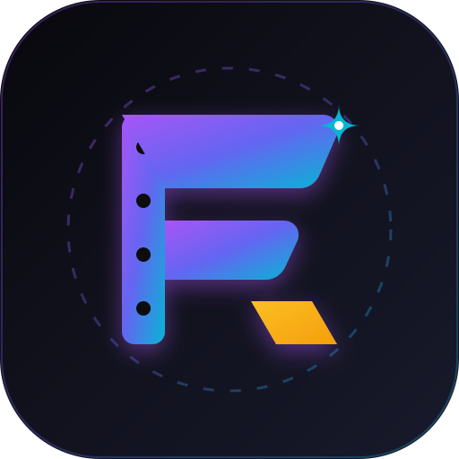

<!--
SPDX-License-Identifier: MIT
-->

# 剧工 (Fablr) 

> 🎬 **开源 AI 影视/短剧解说创作工坊 · 本地优先 · 结构化剧本骨架 · 以文剪片 · 剪映草稿协议互通 · 5 级防搬运消重 · 多平台矩阵分发**

[](LICENSE)
[](https://tauri.app/)
[](https://react.dev/)
[](https://www.typescriptlang.org/)
[](https://www.rust-lang.org/)
[](CHANGELOG.md)

---

## 📖 项目简介

**剧工 (Fablr)** 是一款专为**影视解说、微短剧二次创作、高光混剪**量身打造的开源桌面级全链路创作平台。

平台基于 **Tauri 2 + Rust + React 18 + Vite 6** 现代技术栈构建，秉承 **100% 本地优先 (Local-First)** 架构哲学。围绕创作者真实心智模型，重构为标准的 **四大核心创作工坊**，打通从长片素材拆解到全网矩阵合规分发的极速闭环。

---

## 🏭 四大核心创作工坊工作流

```
┌─────────────────────────────────────────────────────────────────────────────┐
│                       剧工 Fablr 全链路创作流水线                            │
├───────────────────┬───────────────────┬───────────────────┬─────────────────┤
│ 1. 素材拆条工坊    │ 2. 剧本研磨工坊    │ 3. 剪辑合成工作台  │ 4. 消重发布中心 │
│   (Asset Hub)     │  (Script Studio)  │    (Workspace)    │  (Export Hub)   │
│ · 场景/镜头拆解   │ · 🪝 黄金3秒 Hook  │ · 📝 剧本/以文剪片│ · 5级指纹消重   │
│ · 台词/情感检索   │ · 📖 主线/反转卡片│ · 🎬 5轨多轨时间轴│ · 发布合规体检  │
│ · AI高光热力图    │ · ⏱️ TTS时长估算   │ · 导出剪映标准草稿│ · 矩阵一键分发  │
└───────────────────┴───────────────────┴───────────────────┴─────────────────┘
```

### 1. 🎞️ 素材拆条工坊 (Asset Hub)
- **智能场景拆解**：基于 FFprobe 与自研镜头边界检测算法，秒级自动切分长视频场景；
- **台词与高光检索**：输入“拔枪”或“真相只有一个”，直达对应时间戳切片；
- **情感标签自动打标**：自动识别打斗🥊、悬疑🔍、反转🔄、高潮💥等镜头类型。

### 2. 🎭 剧本研磨工坊 (Script Studio)
- **结构化剧本骨架卡片**：提供 `黄金3秒 Hook`、`主线递进`、`高潮反转`、`互动结尾` 四段式创作卡片；
- **配音时长实时估算**：按中文朗读速率实时计算每段台词与全片预估秒数，精确把控叙事节奏；
- **多 Agent 协同**：解说编剧 Agent、黄金 Hook Agent、情绪节奏 Agent 协同润色与续写。

### 3. 🎬 剪辑合成工作台 (Workspace)
- **“以文剪片”双联视图**：支持 `剧本视图`（文本流 ↔ 监看窗口）与 `时间轴视图`（5轨视听剪辑）一键切换；
- **画随音动联动**：剧本修改实时对齐音频与视频切片；
- **剪映草稿协议导出**：直接生成剪映标准工程文件（`draft_content.json`），无缝导入剪映精修。

### 4. 🛡️ 消重发布中心 (Export Hub)
- **5 级智能指纹消重滤镜**：微距呼吸缩放 (1.02x-1.05x)、电影胶片微噪点、智能光影重构、动态画中画、镜头水平镜像；
- **发布前合规体检**：智能评估版权相似度与敏感词风险并输出评级；
- **矩阵多平台分发**：支持抖音、快手、微信视频号、B站、小红书多账号一键极速分发。

---

## 📚 官方文档体系

查看完整的 [📖 剧工 Fablr 官方文档中心](docs/README.md)：

- **系统架构**：[系统目标架构设计](docs/architecture/01-system-overview.md) | [Rust DDD 仓储层设计](docs/architecture/02-rust-backend-ddd.md)
- **功能指南**：[素材拆条工坊](docs/features/01-asset-hub.md) | [剧本研磨工坊](docs/features/02-script-studio.md) | [剪辑合成工作台](docs/features/03-workspace-editing.md) | [消重发布中心](docs/features/04-export-dedup.md)
- **使用教程**：[30秒快速上手](docs/guides/01-quick-start.md) | [博主标准创作 SOP](docs/guides/02-workflow-sop.md)
- **开发者专区**：[搭建开发环境](docs/developer/01-getting-started.md) | [测试与质量验证](docs/developer/02-testing-and-verify.md) | [命名规范约定](docs/developer/03-naming-convention.md)

---

## 🚀 快速启动

### 📦 前置环境 REQUIREMENTS

- **Node.js**: `>= 20.x`
- **Rust**: `>= 1.80`
- **FFmpeg**: `>= 6.0`

### 🔨 运行与构建

```bash
# 1. 安装前端依赖
npm install

# 2. 启动桌面端开发模式 (Tauri 2)
npm run tauri dev

# 3. 生产发布构建
npm run build
npm run tauri build
```

---

## 🧪 自动化测试与工程验证

```bash
# 执行代码规范与一致性校验 (AntD 零泄露 / Kebab 命名 / 循环依赖检测 / Token 一致)
npm run verify:all

# 执行前端 165 个测试文件 (2,562 个测试用例)
npm run test:run

# 执行 Rust 后端单元与集成测试 (135 个测试用例)
cd src-tauri && cargo test
```

---

## 📄 开源许可证

本项目采用 [MIT License](LICENSE) 开源许可证。
