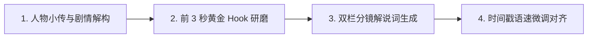

# 多 Agent 剧本工坊与双栏分镜对齐设计

## 1. 多 Agent 协作链路

## 2. 核心 Agent 职责

1. **`DramaDeconstructAgent`**：
   * 自动解析视频原片台词与核心剧情冲突；
   * 提取主角、对手与关键配角的人物小传、性格弧光与阵营关系。
2. **`HookCraftAgent`**：
   * 专为微短剧与短视频设计，在前 3 秒制造高潮反转倒叙与悬念钩子；
   * 保证前 3 秒留存率与点击吸睛度。
3. **`CommentaryWriterAgent`**：
   * 输出标准的专业影视双栏分镜表（镜头景别、时间码、画面描述、旁白解说词、音效建议）；
   * 标注高潮反转、讽刺压抑、热血战斗等情绪张力等级。
4. **`StoryboardAlignerAgent`**：
   * 结合发音人语速（BPM / 字符每秒）自动微调字幕与切片镜头的起止毫秒时间戳。
