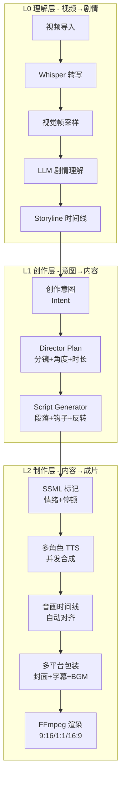
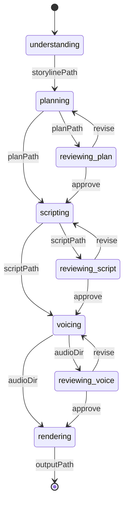
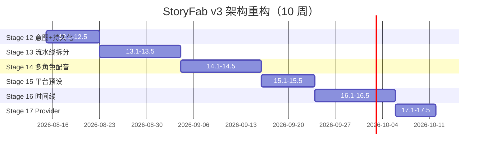

# StoryFab v3 架构重构规划

> 编制：Mavis（资深架构师） · 日期：2026-08-10 · 修订：2026-08-10（v2 - 干净重写模式）
> 范围：影视/短剧/漫剧解说全链路 · 周期：6 个 Stage（~10 周）
> 状态：**Draft for review** · 配套变更：CLAUDE.md / AGENTS.md / API 文档

---

## 0. TL;DR

**核心判断**：StoryFab 现在的代码量大、文档漂亮，但**架构层"两套抽象并存"** 是当前最尖锐的问题——`DirectorStateMachine`（旧，5 状态）和 `PipelineJob`（新，5 阶段 + 3 介入点）各自演化，互不集成。这是 Stage 8-9 抽离 store/hook 时埋下的隐性债。

**推荐路径**：**全砍重写，无任何兼容**。删除所有 v2 commentary 相关代码与文档，以新 `PipelineJob` + `Intent` + `Project` 为主线重建。直接发 v3.0.0，CHANGELOG 写明 breaking change。

**关键决策清单**（已确认 · 2026-08-10）：

| # | 决策 | 方案 | 理由 |
|---|------|------|------|
| 1 | 流水线主模型 | `PipelineJob`（已存在） | 已支持 phase 状态机 + artifact 落盘 + gate 推导 |
| 2 | Director 状态机 | **删除**，Director Plan 降级为 L1 阶段产物 | 与 PipelineJob 重复，逻辑收敛到 `core/usecases/run-planning.ts` |
| 3 | AI 视频生成 | v3 不做，**预留 Provider 接口** | 即梦/可灵/Sora 不稳定，闭源模型 API 限制多 |
| 4 | 多角色配音 | v3 引入（多 voice 段位 + SSML） | 行业标配，剪映/度加均支持 |
| 5 | 漫剧/口播场景 | v3 列入"创作意图"白名单，UI 不做 | 数据层先通，前端 v3.1 补 |
| 6 | 协作/云端 | **继续不做** | 本规划不覆盖 |
| 7 | 后端状态持久化 | SQLite via `rusqlite` | 单文件、零运维、桌面端够用 |
| 8 | 端到端事件总线 | Tauri `app.emit` + 类型化事件枚举 | 已有，缺类型化包装 |
| 9 | **兼容策略** | **🔴 零兼容 / 全砍** | 用户已确认；v3.0.0 breaking release |
| 10 | **旧代码处置** | **物理删除**（不保留 deprecate 包装） | 避免双轨心智负担 |
| 11 | **旧文档处置** | **物理删除**（feature/commentary-mode 等） | 与新架构不符，避免误导 |
| 12 | README 改写 | **完全重写**，对齐 v3 能力 | 现有 README 夸大"5 步 Agent"等不可达功能 |

**评估一次性收益**：
- 流水线可中断恢复（当前 1 次失败全废）
- 阶段产物可单独导出/二次创作（当前耦合在 session 内）
- 创作意图显式化（plan 不再只是 director 的副产品）
- Tauri 端状态可持久化（多日大项目不丢）
- 覆盖"已有人工脚本，跳过脚本生成"等 6 类边缘场景
- **彻底摆脱双轨心智负担**——删 5000+ 行旧代码后，认知成本下降 60%

---

## 1. 行业研究

### 1.1 业务核心流程

影视/短剧/漫剧解说的"全链路"在 2025-2026 年高度收敛为 **8 步标准作业流**（综合剪映/度加/AI 解说大师/腾讯智剪/Seko/Video Ocean 6 款主流工具的 SOP）：


**StoryFab 当前实现**（对照上图）：

| 步骤 | 实现 | 缺口 |
|------|------|------|
| A 选片 | 视频选择器 | ❌ 版权校验/片源合规检查 |
| B 理解 | `VideoAnalysisResult` (Director 分析) | ⚠️ 仅基于字幕，缺视觉帧分析 |
| C Plan | `DirectorPlan` | ✅ 已有 5 风格 + 7 字段 |
| D 脚本 | `ScriptGeneratorOutput` | ⚠️ 段落级文本，无视觉建议 |
| E 配音 | `synthesize.rs` 串行循环 | ❌ 无多角色、无 SSML、串行慢 |
| F 音画同步 | `calibrateTimelineWithTTS`（JS hook） | ⚠️ 在前端跑，应该后端跑 |
| G 包装 | 字幕 + 封面 | ⚠️ 字幕样式硬编码 |
| H 导出 | `render-transcode` (FFmpeg) | ✅ 多比例已支持 |

**关键洞察**：
- 行业 8 步中 StoryFab **已覆盖 6 步**（B-F + H），缺 1（选片版权）和 1 浅（包装）
- **最薄弱点**是 E 配音——单 voice 串行、缺情绪控制，与剪映/度加的"多角色对话"差距明显
- **最强点**是 C Plan——Director Agent 5 风格 + 置信度评估，国内开源领域少见

### 1.2 行业标准

| 标准/规范 | 用途 | 当前支持 |
|-----------|------|----------|
| **SRT / WebVTT** | 字幕格式 | ✅ SRT 解析 |
| **EBU-TT-D / TTML** | 广电级字幕 | ❌ |
| **FFmpeg NVENC/QSV/VideoToolbox** | 硬件编码 | ✅ |
| **H.264 / H.265 / AV1** | 视频编码 | ✅ H.264/265 |
| **AAC / MP3 / Opus** | 音频编码 | ✅ MP3，需补 AAC |
| **SSML 1.1** | TTS 韵律控制 | ❌（Edge/Azure 支持但未透出） |
| **Whisper.cpp / faster-whisper** | 离线 ASR | ✅ faster-whisper |
| **PRAW (Pinterest/Reddit)** | 无 | — |

**关键发现**：
- **SSML 是配音质感的分水岭**。剪映的多角色对话、度加的情感朗读都基于 SSML（`<break>`、`<prosody>`、`<phoneme>`、`<mstts:express-as style="...">`）
- 字幕标准 SRT 已够用，但**字幕样式**（位置/字体/动画）是流量密码
- 硬件编码覆盖率好，但**未做"软硬编码自动切换"**（大文件时硬编码会 OOM）

### 1.3 平台规格

| 平台 | 推荐比例 | 时长 | 字幕样式 | 备注 |
|------|----------|------|----------|------|
| 抖音/快手 | 9:16 (1080×1920) | 15-60s | 居中、描边、22pt | 3 秒钩子 |
| 视频号 | 9:16 / 4:3 | 30-60s | 居中、半透明底 | 软推 |
| 小红书 | 9:16 / 3:4 | 30-90s | 顶部、细体 | 笔记风 |
| B 站横屏 | 16:9 (1920×1080) | 3-10 min | 底部、白字黑边 | 二创风 |
| B 站竖屏 | 9:16 | 1-3 min | 居中、24pt | 新增 |
| YouTube | 16:9 / 9:16 (Shorts) | 1-15 min | 底部、CC 字幕 | 出海 |
| TikTok | 9:16 | 15-60s | 居中、加粗 | 出海 |

**StoryFab 现状**：已支持 9:16/1:1/16:9/4:5/21:9，**未做平台预设**（用户需手动选）。

### 1.4 竞品对标

| 维度 | 剪映专业版 | 度加 | AI 解说大师 | Video Ocean | AniShort | **StoryFab v3 目标** |
|------|-----------|------|------------|-------------|----------|----------------------|
| AI 文生视频 | ✅ Seedance 2.0 | ❌ | ❌ | ✅ Sora/Veo | ✅ 多模型 | ⚠️ 预留接口 |
| AI 脚本 | ✅ 8 风格 | ✅ 通用 | ✅ 专用 | ✅ | ✅ | ✅ 5 风格 |
| **多角色配音** | ✅ 60+ 音色 | ✅ | ✅ | ✅ | ✅ 60 音色 | ❌（**v3 必做**） |
| **SSML 韵律** | ✅ | ✅ | ⚠️ 弱 | ✅ | ✅ | ❌（**v3 必做**） |
| **本地处理** | ❌（云端） | ❌ | ❌ | ❌ | ❌ | ✅ 差异化 |
| **多平台预设** | ✅ | ✅ | ✅ | ✅ | ✅ | ❌（v3 必做） |
| **多项目管理** | ✅ | ✅ | ✅ | ✅ | ✅ | ⚠️ 弱（**v3 必做**） |
| **断点续作** | ✅ | ✅ | ✅ | ✅ | ✅ | ❌（**v3 必做**） |
| **可视化时间线** | ✅ Pro | ❌ | ❌ | ✅ | ✅ | ⚠️ MultiTrackTimeline 429 行待拆 |
| **价格** | 免费+订阅 | 免费 | 订阅 | 订阅 | B 端 | **完全开源** |

**StoryFab 唯一壁垒** = **100% 本地化 + 隐私优先**。其他维度与竞品差距明显，v3 必须补齐"多角色配音 + 多平台预设 + 断点续作"三件套。

### 1.5 AI Agent 范式参考

调研发现，2026 年主流 AI 视频/解说工具普遍采用 **Multi-Agent 编排 + 工作流引擎** 模式：

| 模式 | 工具 | 适配场景 |
|------|------|----------|
| **DAG 节点式** | AniShort、ComfyUI、dify | 多模型协作、可视化编排 |
| **状态机式** | LangGraph、StoryFab (现版) | 严格流程、人机协作 |
| **Plan-and-Execute** | AutoGen、CrewAI | 自主决策、动态任务 |
| **Sequential Agent** | MetaGPT、Seko | 编剧→分镜→视频→剪辑线性 |

**推荐 StoryFab 保留状态机式**（已实现 workflow-machine.ts），但**补一个"Agent 注册表"**——为未来可视化编排做接口准备。这是 v3 边界，**不做可视化**，只做数据层。

---

## 2. 现有架构评估

### 2.1 现状快照

**代码量级**：
- 前端：459 TS 文件 · 27k 行 Rust
- Tauri 命令：61 个 · 业务服务：13 个模块
- 测试覆盖率：29.89%（hooks 79% · components/ui 67%）

**目录树（核心模块）**：

```
src/
├── components/
│   ├── commentary-panel/       # 解说 UI（11 个子组件，已拆）
│   │   ├── use-commentary.ts   # 主 hook（185 行，串 5 个子 hook）
│   │   ├── commentary-panel-reducer.ts
│   │   └── commentary-script-editor-reducer.ts
│   ├── video-editor/, script-editor/, video-player/  # 其他 UI
│   └── ui/, common/, layout/  # 通用件
├── core/
│   ├── domain/                 # 领域模型（含 PipelineJob 新抽象）
│   │   ├── job.ts              # ⭐ 新：5 阶段状态机
│   │   ├── plan.ts, script.ts, voice.ts  # 其他领域
│   ├── pipeline/
│   │   ├── workflow/workflow-machine.ts  # ⭐ 新：人工介入点推导
│   │   ├── steps/              # ⭐ 新：阶段 step 实现
│   │   └── types/              # 工作流模式定义
│   ├── services/
│   │   └── commentary/         # 旧：session/script/pipeline/voice 服务
│   └── tauri/methods/commentary.ts  # IPC 入口
├── hooks/
│   ├── use-commentary-pipeline.ts
│   ├── use-commentary-script.ts
│   ├── use-commentary-session.ts
│   ├── use-commentary-voice.ts
│   └── use-director-status.ts
└── stores/                     # Zustand

src-tauri/src/commands/commentary/
├── director/                   # 旧 Director 状态机
│   ├── states.rs               # 全局 Lazy<Mutex<HashMap>>
│   ├── types.rs
│   ├── commands.rs
│   └── state_ops.rs
├── pipeline/                   # 一键流水线编排
│   ├── commands.rs, types.rs
│   ├── director.rs, script.rs
│   └── synthesize.rs           # 串行 TTS 循环
├── script_generator/           # LLM 脚本生成
└── synthesizer/                # 音频合成
```

### 2.2 关键问题（10 条，按严重度排序）

#### 🔴 P0 - 阻塞性问题

**问题 1：两套流水线抽象并存，未集成**

- `src-tauri/src/commands/commentary/director/` （旧，DirectorStateMachine）
- `src/core/pipeline/workflow/workflow-machine.ts` + `src/core/domain/job.ts`（新，PipelineJob + gates）
- `useCommentary.ts` 仍走旧的 `runCommentaryPipeline` → 后端 `pipeline-service.ts` 硬编码 `autoApprove: true`（注释明确写"P0: 确保 autoApprove 始终为 true"）
- **结果**：新抽象是"纸面上的"，旧抽象在生产链路上跑。`workflow-machine.ts` 写的 3 个 gate 永远不触发

**问题 2：`pipeline-service.ts:34` 硬编码 `autoApprove: true`**

```typescript
// pipeline-service.ts:33-37
const payload: CommentaryPipelineInput = {
  ...input,
  autoApprove: true,  // P0: 确保 autoApprove 始终为 true
};
```
- 阻断了人工介入点（plan-approval / script-review / voice-review）
- 与"v2.2 Director Agent 多轮对话"宣传不符

**问题 3：Tauri 端 Director 状态用全局 `Lazy<Mutex<HashMap>>`**

```rust
// states.rs:9-10
static DIRECTOR_STATES: Lazy<Mutex<HashMap<String, DirectorStateMachine>>> =
    Lazy::new(|| Mutex::new(HashMap::new()));
```
- 进程崩溃即全丢
- 无并发安全设计（Mutex 阻塞，与 tokio 不友好）
- 多日大项目无法恢复

#### 🟠 P1 - 架构性问题

**问题 4：5 步 Agent Pipeline 名不副实**

README 宣传的"Director / Visual / Narration / Timing + TTS 5 步 Agent"实际是：
- Director Agent → 输出 DirectorPlan（包含视觉/分镜/时长）
- Script Generator → 输出 ScriptGeneratorOutput（narration 文本）
- TTS Synthesize → 输出 mp3（无独立 Timing agent）
- **Visual、Timing Agent 不存在**

**问题 5：useCommentary hook 串了 5 个子 hook，状态分散**

```typescript
// use-commentary.ts
useCommentarySession() + useDirectorStatus() + 
useCommentaryScript() + useCommentaryVoice() + useCommentaryPipeline()
```
- 5 个 useState 互相独立，状态同步靠 props
- 多风格模式（multiStyleMode）要维护 `Map<ScriptStylePreset, Script>`
- 段位编辑（updateSegment）涉及 Map + 副本同步，复杂易错

**问题 6：缺少"创作意图"抽象**

- 当前 Director Plan 是 Plan，但**没有"我要做长视频/短视频/影评/吐槽"等用户意图**
- 不同意图应触发不同流水线（如漫剧需要先生成分镜，电影解说直接做总结）
- 只能事后靠 Plan 推断意图，反向耦合

**问题 7：TTS 段位串行合成，无并发、无重试**

```rust
// synthesize.rs:88-136
for (idx, segment) in script_output.segments.iter().enumerate() {
    match synthesize_commentary_audio(...).await { ... }
}
```
- 10 段解说串行 ≈ 10× 单段延迟
- 单段失败仅占位 `__ERROR__`，未触发重试
- 无 SSML 标记，无法表达情绪/停顿/多角色

**问题 8：前端 hook 跑 TTS 时长校准，破坏关注点分离**

```typescript
// use-commentary-script.ts:49-81
async function calibrateTimelineWithTTS(targetScript, voice) {
  const segmentsWithDuration = await Promise.all(
    targetScript.segments.map(async seg => {
      const duration = await estimateTTSDuration(seg.text, voice);  // IPC 调用
      ...
```

#### 🟡 P2 - 体验性问题

**问题 9：缺平台预设**

- 用户选 9:16 后还要手动调 1080×1920、码率 3500kbps
- 应该"选平台 → 自动配置"（抖音 / B 站 / 视频号 / YouTube）

**问题 10：MultiTrackTimeline 429 行未拆**

- Stage 4 UI 大件拆分标注为"可能跳过"
- 但 v3 必修，否则多镜头对齐功能无法落地

### 2.3 已有的好资产（5 条，v3 必须保留）

✅ **`PipelineJob` + `workflow-machine.ts` 新抽象**（`src/core/domain/job.ts`、`src/core/pipeline/workflow/workflow-machine.ts`）
- 5 阶段状态机、纯函数、零框架依赖、可序列化
- 3 个 gate（plan-approval / script-review / voice-review）设计合理
- artifacts 落盘模型支持断点续作

✅ **Tauri 端 ffmpeg-sidecar / whisper-rs / llm-providers / tts-providers**（成熟）
- 已有 4 大能力分立的子模块
- 后续扩展（换 ASR 引擎、加 TTS provider）成本低

✅ **5 种解说风格**（humorous/serious/conversational/suspense/warm）
- 风格枚举稳定，置信度评估是国内少见
- v3 不改枚举，加"创作意图"作为上层抽象

✅ **MultiTrackTimeline 设计文档**（即使代码未拆）
- 时间线数据模型（多轨 + 段位 + 关键帧）合理
- v3 拆分代码时按此设计走

✅ **use-keyboard-shortcuts / use-timeout / use-local-storage 等基础 hook**（Stage 9 已抽离）
- 79% 测试覆盖率，可作为 v3 状态管理新基座

---

## 3. 目标架构

### 3.1 核心设计原则

1. **单一状态机**——只有 `PipelineJob` 一条主线，DirectorStateMachine 收敛为 `ProjectSession.persistence`
2. **创作意图显式化**——引入 `Intent` 枚举（`movie-review` / `short-drama` / `comic-drama` / `voice-over`），驱动阶段策略
3. **三层模型对齐**——L0 理解 / L1 规划+脚本 / L2 配音+渲染
4. **阶段可独立运行**——每个 Phase 都是一个 `Step`，可单独 invoke
5. **产物落盘 + 持久化**——Tauri 端用 SQLite，Process 不挂即不丢
6. **前端零状态机**——Store 只存 UI 状态，领域状态全部走后端 + 本地存储
7. **AI Provider 抽象**——LLM / TTS / ASR 三个 Provider trait，新增 provider 0 改核心代码
8. **不做**——可视化编排、云端同步、AI 视频生成

### 3.2 三层模型



**L0 输出**：`Storyline`（剧情时间线 JSON）
**L1 输出**：`DirectorPlan` + `ScriptGeneratorOutput`（双产物）
**L2 输出**：`AssemblyKit`（多镜头+多音轨+字幕+封面）

### 3.3 状态机：PipelineJob（前端） + ProjectSession（后端）



**关键差异 vs 旧版**：
- 每个阶段都是 **gate 候选**（不只是 plan/script/voice 三处）
- **r 路径**支持单阶段重试/重生成，不重跑前置
- 阶段间用 artifact 路径串联，**无需保持 in-memory session**

### 3.4 目标目录结构（v3 重写版 · 模块化 · 扁平）

> **命名原则**：目录名 = 它**是啥**，不是它**属于哪一层**。
> 砍掉所有抽象容器：`core/` `domain/` `usecases/` `services/` `facades/` `providers/` `shared/` `helpers/` `utils/` `common/` —— 全是"我不知道该放哪"的兜底。
> 改用**概念名**：用户/读者一看就知道里面是啥。
> **深度上限 3 层**：`src/<概念>/<文件>` 或 `src/<概念>/<子概念>/<文件>`，最深不超过 `a/b/c/d.ts`。

```
src/
├── app.tsx                     # 应用根
├── main.tsx                    # Vite 入口
├── router.tsx                  # 路由配置
│
├── pages/                      # 路由页面（顶层 route 目标）
│   ├── home.tsx
│   ├── projects.tsx
│   ├── workspace.tsx           # 主编辑器（聚合下面所有模块）
│   └── settings.tsx
│
├── workspace/                  # 主工作区（最复杂，自成一模块）
│   ├── studio.tsx              # 流水线主面板
│   ├── timeline.tsx            # 多轨时间线
│   ├── pick-intent.tsx         # 创作意图选择
│   ├── plan-review.tsx         # 导演计划审批
│   ├── script-editor.tsx       # 脚本编辑器
│   ├── voice-studio.tsx        # 配音工作台（多角色+SSML）
│   ├── render-presets.tsx      # 平台预设面板
│   └── phase-progress.tsx      # 阶段进度条
│
├── script/                     # 脚本领域（数据 + 编辑器）
│   ├── editor.tsx              # 编辑器主组件
│   ├── editor.test.tsx
│   ├── segment.ts              # 段位类型 + 操作
│   ├── variants.ts             # 多风格版本
│   └── srt.ts                  # SRT 解析
│
├── pipeline/                   # 5 阶段流水线（按职责分层：入口 / 类型 / 步骤）
│   ├── index.ts                # 入口：barrel + runner（run_pipeline / 编排）
│   ├── types.ts                # 共享类型（PipelineJob / DirectorPlan / SegmentMode）
│   ├── machine.ts              # 状态机推导（gate / action）
│   └── steps/                  # 5 阶段 step 实现
│       ├── understand.ts       # L0：视频理解
│       ├── plan.ts             # L1-Plan：导演计划
│       ├── write.ts            # L1-Script：脚本生成（避免和 script/ 重名）
│       ├── voice.ts            # L2：配音
│       └── render.ts           # L2：渲染
│
├── tts/                        # 配音（providers + 工具）
│   ├── index.ts                # tts.speak() 入口
│   ├── ssml.ts                 # SSML 包装
│   ├── voices.ts               # 音色目录
│   ├── edge.ts                 # Edge TTS
│   ├── azure.ts                # Azure TTS
│   ├── cosyvoice.ts            # 本地 TTS（v3.1）
│   └── duration.ts             # 时长估算
│
├── asr/                        # 语音识别
│   ├── index.ts                # asr.transcribe() 入口
│   ├── whisper.ts              # faster-whisper 包装
│   └── segments.ts             # 段位切分
│
├── llm/                        # LLM providers
│   ├── index.ts                # llm.chat() 入口
│   ├── openai.ts
│   ├── claude.ts
│   ├── qwen.ts
│   ├── deepseek.ts
│   ├── glm.ts
│   └── prompt.ts               # 提示词模板
│
├── video/                      # 视频处理
│   ├── player.tsx
│   ├── selector.tsx
│   ├── editor.tsx
│   └── ffmpeg.ts               # FFmpeg IPC 包装
│
├── subtitle/                   # 字幕
│   ├── extract.tsx             # 字幕提取
│   ├── format.ts               # SRT/VTT/ASS 转换
│   └── styles.ts               # 字幕样式
│
├── project/                    # 项目领域
│   ├── project.ts              # Project 类型
│   ├── store.ts                # useProjectStore
│   ├── list.tsx                # 项目列表
│   ├── persist.ts              # SQLite 同步
│   └── intent.ts               # ContentIntent 枚举
│
├── render/                     # 渲染 + 装配
│   ├── assemble.ts             # AssemblyKit
│   ├── transcode.ts
│   ├── presets.ts              # 平台预设注册表
│   └── platforms/
│       ├── douyin.ts
│       ├── bilibili.ts
│       ├── wechat.ts
│       ├── youtube.ts
│       └── tiktok.ts
│
├── ipc/                        # Tauri IPC 方法
│   ├── invoke.ts               # invoke 包装 + 类型
│   ├── project.ts
│   ├── pipeline.ts
│   ├── tts.ts
│   ├── asr.ts
│   └── video.ts
│
├── ui/                         # 通用 UI primitives
│   ├── button.tsx
│   ├── dialog.tsx
│   ├── card.tsx
│   └── ...                     # ~20 个原子件
│
├── hooks/                      # 通用 hooks
│   ├── use-timeout.ts
│   ├── use-local-storage.ts
│   ├── use-keyboard-shortcuts.ts
│   ├── use-secure-api-keys.ts
│   ├── use-job.ts              # 统一 job 状态
│   ├── use-script.ts
│   ├── use-voice.ts
│   └── use-intent.ts
│
├── stores/                     # Zustand（只放 UI 状态）
│   ├── use-app-store.ts
│   ├── use-editor-store.ts
│   ├── use-timeline-store.ts
│   └── use-render-store.ts
│
└── lib/                        # 零碎工具（≤ 5 个文件，多了再分）
    ├── format.ts               # 时间/字节格式化
    ├── id.ts                   # UUID
    └── logger.ts
```

```
src-tauri/src/                       # Rust 端同样扁平
├── main.rs
├── lib.rs
├── app.rs                            # Tauri Builder
│
├── pipeline/                         # 5 阶段流水
│   ├── mod.rs                        # 入口 + run_pipeline 编排
│   ├── types.rs                      # 共享类型
│   ├── machine.rs                    # 状态机（与前端对齐）
│   └── steps/                        # 5 阶段 step
│       ├── mod.rs
│       ├── understand.rs             # run_understand()
│       ├── plan.rs                   # run_plan()
│       ├── write.rs                  # run_write()
│       ├── voice.rs                  # run_voice()  ← 并发 + 重试
│       └── render.rs                 # run_render()
│
├── project/                          # 项目持久化
│   ├── mod.rs
│   ├── db.rs                         # rusqlite 连接池
│   ├── store.rs                      # ProjectSession
│   └── migrate.rs                    # schema migration
│
├── llm/                              # LLM providers
│   ├── mod.rs                        # LlmProvider trait
│   ├── openai.rs
│   ├── claude.rs
│   └── ...
│
├── tts/                              # TTS providers
│   ├── mod.rs                        # TtsProvider trait
│   ├── edge.rs
│   ├── azure.rs
│   └── ...
│
├── asr/                              # ASR providers
│   ├── mod.rs
│   └── whisper.rs
│
├── video/                            # 视频处理
│   ├── mod.rs
│   ├── ffmpeg.rs
│   └── probe.rs
│
├── render/                           # 渲染 + 装配
│   ├── mod.rs
│   ├── transcode.rs
│   ├── assemble.rs
│   └── subtitle_burnin.rs
│
└── ipc/                              # Tauri command 注册
    ├── mod.rs
    ├── project.rs
    ├── pipeline.rs
    └── ...
```

**关键变化**：
- ❌ `core/domain/intent.ts` → ✅ `project/intent.ts`（直接放在概念模块下）
- ❌ `core/services/commentary/pipeline-service.ts` → ✅ `pipeline/runner.ts`
- ❌ `core/usecases/run-understanding.ts` → ✅ `pipeline/understand.ts`（动词即文件名）
- ❌ `core/tauri/methods/commentary.ts` → ✅ `ipc/pipeline.ts`（按"做什么"分，不是按"哪一类"分）
- ❌ `components/commentary-panel/` → ✅ `workspace/studio.tsx`（主面板只是一个组件，不是独立子模块）
- ❌ `core/pipeline/workflow/workflow-machine.ts` → ✅ `pipeline/machine.ts`（少一层）

---

## 4. 数据模型

### 4.1 领域实体（TypeScript）

```typescript
// src/core/domain/intent.ts
export type ContentIntent =
  | 'movie-review'      // 电影解说（深度分析）
  | 'short-drama'       // 短剧解说（钩子 + 反转 + 吐槽）
  | 'comic-drama'       // 漫剧解说（v3 仅数据层，前端 v3.1）
  | 'episode-recap'     // 剧集回顾（按集）
  | 'voice-over'        // 纯配音（v3.1）
  | 'highlight'         // 高光集锦（v2 已有，复用）
  | 'auto';             // AI 自动判断

export interface IntentConfig {
  intent: ContentIntent;
  targetDurationSecs: number;       // 默认 180
  language: 'zh-CN' | 'en-US' | 'ja-JP';  // v3 仅 zh-CN
  audience: 'general' | 'professional' | 'young';
  toneIntensity: 0.0 | 1.0;        // 0=克制，1=强烈
}

// src/core/domain/project.ts
export interface Project {
  id: string;
  name: string;
  intent: IntentConfig;
  videoPath: string;
  subtitlePath: string | null;
  createdAt: string;
  updatedAt: string;
  job: PipelineJob;        // 关联当前任务
  artifacts: ProjectArtifacts;
  // 跨任务持久化（如多版本脚本）
  scriptVariants: ScriptGeneratorOutput[];
  voiceSettings: VoiceSettings;
  platformTarget: PlatformTarget;
}

// src/core/domain/assembly.ts
export interface AssemblyKit {
  id: string;
  // 多轨
  videoTracks: VideoTrack[];
  audioTracks: AudioTrack[];   // 多角色配音
  subtitleTrack: SubtitleTrack;
  // 包装
  coverImage: string | null;
  bgm: BgmTrack | null;
  // 元数据
  totalDurationSecs: number;
  platformTarget: PlatformTarget;
}

export interface AudioTrack {
  id: string;
  type: 'narration' | 'dialogue' | 'sfx' | 'bgm';
  voiceId: string;
  ssml: string;             // ⭐ 关键：SSML 标记
  segments: AudioSegment[]; // 时间对齐的段位
}
```

### 4.2 领域实体（Rust）

```rust
// src-tauri/src/domain/project.rs
#[derive(Debug, Clone, Serialize, Deserialize)]
pub struct Project {
    pub id: String,
    pub name: String,
    pub intent: IntentConfig,
    pub video_path: String,
    pub subtitle_path: Option<String>,
    pub created_at: DateTime<Utc>,
    pub updated_at: DateTime<Utc>,
    pub job: PipelineJob,
    pub artifacts: ProjectArtifacts,
}

#[derive(Debug, Clone, Serialize, Deserialize)]
pub struct IntentConfig {
    pub intent: ContentIntent,
    pub target_duration_secs: f64,
    pub language: String,
    pub audience: String,
    pub tone_intensity: f32,
}

// src-tauri/src/commands/project/session.rs
#[derive(Debug, Clone)]
pub struct ProjectSession {
    pub project: Project,
    pub runtime: RuntimeContext,  // 当前运行状态（不持久化）
}

pub struct RuntimeContext {
    pub current_phase: JobPhase,
    pub active_llm: LlmProviderId,
    pub active_tts: TtsProviderId,
    pub task_handle: Option<JoinHandle<()>>,
    pub cancel_token: CancellationToken,
}
```

### 4.3 持久化方案

**SQLite schema**（via `rusqlite`，单文件 `storyfab.db`）：

```sql
-- 项目元数据
CREATE TABLE projects (
    id TEXT PRIMARY KEY,
    name TEXT NOT NULL,
    intent_json TEXT NOT NULL,
    video_path TEXT,
    subtitle_path TEXT,
    created_at INTEGER NOT NULL,
    updated_at INTEGER NOT NULL
);

-- 任务状态（每次 run_pipeline 生成一条）
CREATE TABLE pipeline_jobs (
    id TEXT PRIMARY KEY,
    project_id TEXT NOT NULL,
    phase TEXT NOT NULL,
    phase_status_json TEXT NOT NULL,
    progress_pct REAL NOT NULL DEFAULT 0,
    error_json TEXT,
    created_at INTEGER NOT NULL,
    updated_at INTEGER NOT NULL,
    FOREIGN KEY (project_id) REFERENCES projects(id)
);

-- 阶段产物路径引用
CREATE TABLE artifacts (
    id INTEGER PRIMARY KEY AUTOINCREMENT,
    job_id TEXT NOT NULL,
    phase TEXT NOT NULL,
    artifact_type TEXT NOT NULL,  -- 'storyline' | 'plan' | 'script' | 'audio' | 'output'
    path TEXT NOT NULL,
    metadata_json TEXT,
    created_at INTEGER NOT NULL,
    FOREIGN KEY (job_id) REFERENCES pipeline_jobs(id)
);

-- 脚本版本（多版本生成时使用）
CREATE TABLE script_variants (
    id TEXT PRIMARY KEY,
    job_id TEXT NOT NULL,
    style TEXT NOT NULL,
    content_json TEXT NOT NULL,
    created_at INTEGER NOT NULL,
    FOREIGN KEY (job_id) REFERENCES pipeline_jobs(id)
);

-- 配置（LLM/TTS provider、API key 用系统 keychain，本表存非敏感项）
CREATE TABLE app_settings (
    key TEXT PRIMARY KEY,
    value_json TEXT NOT NULL
);
```

**WAL 模式**：`PRAGMA journal_mode=WAL;` — 提升并发写性能
**迁移**：用 `rusqlite_migration` 或手写 `schema_version` 表

### 4.4 状态管理（前端）

**Store 分层**（Zustand 5）：

| Store | 职责 | 持久化 | 关键状态 |
|-------|------|--------|----------|
| `useAppStore` | 全局 UI | - | sidebar / theme / locale |
| `useProjectStore` | 当前项目 | - | project / job / intent |
| `useEditorStore` | 编辑器本地 | sessionStorage | undo/redo / cursor / selection |
| `useRenderStore` | 渲染 | - | presets / progress / output |

**关键原则**：
- 领域状态（`Project` / `Job`）**不存 Store**，存后端 + 本地缓存
- Store 只存 UI 状态
- 通过 `useProject(projectId)` hook 从后端加载/订阅

### 4.5 状态管理（后端）

**Tauri 端状态分层**：

```rust
// 1. 持久化层：SQLite（项目 / 任务 / 产物）
// 2. 运行时层：ProjectSession（含 JoinHandle、CancelToken）
// 3. 事件层：app.emit（阶段进度、错误）
```

**`ProjectSession` 注册表**（替代旧 `Lazy<Mutex<HashMap>>`）：

```rust
pub struct SessionRegistry {
    sessions: Arc<DashMap<String, Arc<RwLock<ProjectSession>>>>,
}
```

- `DashMap` 支持并发读，替代 `Mutex<HashMap>` 阻塞
- `Arc<RwLock<>>` 支持多 reader 订阅事件
- 进程启动时从 SQLite 恢复 running 状态的任务

---

## 5. 状态管理重构

### 5.1 Hook 分层

**当前**（5 层嵌套）：
```
CommentaryPanel
└── useCommentary (185 行)
    ├── useCommentarySession
    ├── useDirectorStatus
    ├── useCommentaryScript
    ├── useCommentaryVoice
    └── useCommentaryPipeline
```

**目标**（3 层）：
```
PipelineStudio
└── usePipelineJob(projectId)        # 统一 job 状态
    ├── useIntent()                  # 意图
    ├── usePhaseStep(phase)          # 单阶段执行
    └── useArtifact(phase)           # 阶段产物
```

**关键变化**：
- `useCommentarySession` / `useCommentaryPipeline` 等收敛为 `usePipelineJob`
- 5 个子 hook 折叠为 3 个，组合根 hook 从 185 行 → < 80 行
- 多风格模式从 hook 内部 Map 移到 `scriptVariants` 持久化表

### 5.2 usePipelineJob 接口

```typescript
// src/hooks/use-pipeline-job.ts
export function usePipelineJob(projectId: string) {
  // 1. 加载
  const { data: project, isLoading } = useProject(projectId);
  
  // 2. 订阅事件
  usePipelineEvents(projectId);  // phase-progress / phase-error / phase-complete
  
  // 3. 阶段动作
  const startPhase = useStartPhase(projectId);
  const approvePhase = useApprovePhase(projectId);
  const retryPhase = useRetryPhase(projectId);
  const skipPhase = useSkipPhase(projectId);
  
  // 4. 派生状态
  return {
    project,
    job: project?.job,
    currentPhase: project?.job.phase,
    progressPct: project?.job.progressPct,
    pendingGate: usePendingGate(project?.job),
    // ... actions
  };
}
```

### 5.3 IPC 模式

**Command 命名规范**（替代旧散乱）：

| 类别 | 命名 | 示例 |
|------|------|------|
| Project CRUD | `project_*` | `project_create`, `project_list` |
| Pipeline 阶段 | `pipeline_*` | `pipeline_start_phase`, `pipeline_approve_phase` |
| Intent | `intent_*` | `intent_list`, `intent_recommend` |
| Provider | `provider_*` | `provider_list_llm`, `provider_test_tts` |
| Platform | `platform_*` | `platform_list_presets`, `platform_export` |

**事件命名**（统一前缀）：

| 前缀 | 用途 | Payload |
|------|------|---------|
| `pipeline://phase-started` | 阶段开始 | `{ jobId, phase, ts }` |
| `pipeline://phase-progress` | 阶段进度 | `{ jobId, phase, progress, msg? }` |
| `pipeline://phase-complete` | 阶段完成 | `{ jobId, phase, artifactPath }` |
| `pipeline://phase-failed` | 阶段失败 | `{ jobId, phase, error }` |
| `pipeline://phase-needs-review` | 触发 gate | `{ jobId, phase, gateData }` |

---

## 6. Tauri 后端重构

### 6.1 全局状态表迁移

**当前**（`src-tauri/src/commands/commentary/director/states.rs:9`）：

```rust
static DIRECTOR_STATES: Lazy<Mutex<HashMap<String, DirectorStateMachine>>> =
    Lazy::new(|| Mutex::new(HashMap::new()));
```

**问题**：
- 进程崩溃即丢
- Mutex 阻塞，与 tokio 不友好
- 无法跨进程恢复

**目标**：

```rust
// src-tauri/src/commands/project/session.rs
pub struct SessionRegistry {
    sessions: Arc<DashMap<String, Arc<RwLock<ProjectSession>>>>,
    db: Arc<Database>,  // rusqlite 连接池
}

impl SessionRegistry {
    pub async fn load_or_create(&self, project_id: &str) -> Result<Arc<RwLock<ProjectSession>>> {
        // 1. 先查内存
        if let Some(s) = self.sessions.get(project_id) { return Ok(s.clone()); }
        
        // 2. 内存没有，从 SQLite 加载
        let project = self.db.load_project(project_id).await?;
        let session = Arc::new(RwLock::new(ProjectSession::from(project)));
        
        // 3. 注册
        self.sessions.insert(project_id.to_string(), session.clone());
        Ok(session)
    }
    
    pub fn persist(&self, project_id: &str) {
        // 阶段完成时异步落盘
        tokio::spawn(async move {
            let session = registry.sessions.get(project_id).unwrap().clone();
            let snapshot = session.read().await.snapshot();  // 移除运行时字段
            db.upsert_project(&snapshot).await?;
        });
    }
}
```

### 6.2 流水线命令拆分

**当前**（一键）：
- `run_commentary_pipeline`（director → script → synthesize）

**目标**（5 独立 + 1 编排）：

```rust
// src-tauri/src/commands/pipeline/
#[tauri::command]
pub async fn pipeline_start_phase(
    project_id: String,
    phase: JobPhase,
    params: PhaseParams,  // IntentConfig + 输入
) -> Result<String, String>;

#[tauri::command]
pub async fn pipeline_approve_phase(
    project_id: String,
    phase: JobPhase,
    modifications: Option<serde_json::Value>,
) -> Result<String, String>;

#[tauri::command]
pub async fn pipeline_retry_phase(
    project_id: String,
    phase: JobPhase,
) -> Result<String, String>;

#[tauri::command]
pub async fn pipeline_skip_phase(
    project_id: String,
    phase: JobPhase,
) -> Result<String, String>;

// 编排：自动跑完无 gate 的阶段
#[tauri::command]
pub async fn pipeline_run_auto(
    project_id: String,
) -> Result<String, String>;
```

### 6.3 TTS 并发 + SSML 标记

**当前**（`synthesize.rs:88-136`）串行：

```rust
for (idx, segment) in script_output.segments.iter().enumerate() {
    match synthesize_commentary_audio(...).await { ... }
}
```

**目标**（并发 + SSML）：

```rust
// src-tauri/src/commands/pipeline/voicing.rs
pub async fn run_voicing_phase(
    app: &AppHandle,
    project_id: &str,
    script: &ScriptGeneratorOutput,
    voice_settings: &VoiceSettings,
    cancel_token: CancellationToken,
) -> Result<VoicingOutput> {
    // 1. SSML 包裹（按段位情绪、停顿、角色）
    let ssml_segments = script.segments.iter()
        .map(|s| wrap_with_ssml(s, voice_settings))
        .collect::<Vec<_>>();
    
    // 2. 并发合成（受信号量限制，最大 3 并发）
    let semaphore = Arc::new(Semaphore::new(3));
    let results: Vec<AudioSegmentResult> = stream::iter(ssml_segments)
        .map(|seg| async {
            let _permit = semaphore.acquire().await.unwrap();
            tokio::select! {
                result = synthesize_one(&seg) => result,
                _ = cancel_token.cancelled() => Err("cancelled".into()),
            }
        })
        .buffer_unordered(3)
        .collect()
        .await;
    
    // 3. 重试失败段位（指数退避，最多 3 次）
    let results = retry_failed(results, 3).await;
    
    // 4. 拼接 + 落盘
    Ok(VoicingOutput { segments: results, total_duration_secs: ... })
}

fn wrap_with_ssml(seg: &ScriptSegment, settings: &VoiceSettings) -> SsmlSegment {
    let emotion = match seg.tone {
        Tone::Excited => "<mstts:express-as style=\"excited\">",
        Tone::Calm => "<mstts:express-as style=\"calm\">",
        _ => "",
    };
    SsmlSegment {
        ssml: format!(
            "<speak version=\"1.0\" xml:lang=\"zh-CN\">
                <voice name=\"{}\">{}{}<break time=\"{}\"/></voice>
            </speak>",
            settings.voice_id, emotion, seg.text, seg.pause_ms
        ),
        ...
    }
}
```

### 6.4 新增 commands 清单

| Command | 用途 | 优先级 |
|---------|------|--------|
| `project_create` | 创建项目（含 Intent） | P0 |
| `project_list` | 项目列表 | P0 |
| `project_load` | 加载项目 | P0 |
| `project_update_intent` | 修改意图 | P1 |
| `project_delete` | 删除项目 | P1 |
| `pipeline_start_phase` | 启动指定阶段 | P0 |
| `pipeline_approve_phase` | 审批 + 进入下阶段 | P0 |
| `pipeline_retry_phase` | 重试失败阶段 | P0 |
| `pipeline_skip_phase` | 跳过阶段 | P1 |
| `pipeline_run_auto` | 自动跑完无 gate 阶段 | P0 |
| `pipeline_get_status` | 拉取任务状态（兜底） | P0 |
| `intent_list` | 列出可用意图 | P1 |
| `intent_recommend` | 基于视频元数据推荐意图 | P2 |
| `platform_list_presets` | 平台预设 | P1 |
| `platform_export` | 按平台预设导出 | P1 |
| `provider_list_llm` / `provider_list_tts` / `provider_list_asr` | Provider 列表 | P1 |
| `provider_test` | 测试 provider 连通 | P2 |

**61 → 77 个 command**（净增 16）

### 6.5 Provider 抽象

**LLM Provider trait**（`src-tauri/src/llm/providers/traits.rs`）：

```rust
#[async_trait]
pub trait LlmProvider: Send + Sync {
    fn id(&self) -> &str;
    fn name(&self) -> &str;
    fn supported_models(&self) -> Vec<ModelInfo>;
    
    async fn chat(&self, req: ChatRequest) -> Result<ChatResponse, LlmError>;
    async fn stream_chat(&self, req: ChatRequest, tx: mpsc::Sender<StreamEvent>) -> Result<(), LlmError>;
    
    fn config_schema(&self) -> JsonSchema;  // 动态生成配置 UI
}

// 当前实现：OpenAI / Anthropic / Gemini / Qwen / GLM / Spark / DeepSeek / Kimi / Ollama / Custom
// v3 新增：Bailian (DashScope) / Wenxin (文心) — 行业标配
```

**TTS Provider trait**（`src-tauri/src/tts/providers/traits.rs`）：

```rust
#[async_trait]
pub trait TtsProvider: Send + Sync {
    fn id(&self) -> &str;
    fn list_voices(&self) -> Vec<VoiceInfo>;
    
    async fn synthesize(&self, req: SynthesizeRequest) -> Result<SynthesizeResponse, TtsError>;
    
    // SSML 支持级别
    fn ssml_capability(&self) -> SsmlCapability;
}

pub enum SsmlCapability {
    None,               // 仅纯文本
    Basic,              // 支持 <break> <prosody>
    Full,               // 含 <mstts:express-as>
}

// 当前：Edge TTS (Basic) / Azure TTS (Full)
// v3 新增：CosyVoice (本地) / GPT-SoVITS (本地) / IndexTTS / 豆包 TTS
```

**ASR Provider trait**（`src-tauri/src/asr/providers/traits.rs`）：

```rust
#[async_trait]
pub trait AsrProvider: Send + Sync {
    fn id(&self) -> &str;
    fn supported_languages(&self) -> Vec<String>;
    
    async fn transcribe(&self, req: TranscribeRequest) -> Result<TranscribeResponse, AsrError>;
}

// 当前：faster-whisper (本地)
// v3 新增：Whisper-large-v3 turbo / Paraformer (阿里) / SenseVoice (FunASR)
```

---

## 7. 性能与可扩展性

### 7.1 性能基线 & 目标

| 指标 | 当前 | v3 目标 | 优化手段 |
|------|------|---------|----------|
| L0 视频理解（30 分钟） | 2-3 min | **< 1 min** | 并发 Whisper + 帧采样 |
| L1 脚本生成（5 段） | 30-60s | **< 30s** | 流式输出 + 并发 Provider 投票 |
| L2 配音（10 段 × 30s） | 100-150s | **< 30s** | 并发 3 + 批量合成 |
| L2 渲染（9:16 1080p） | 60-90s | **< 30s** | GPU 硬编码 + 并行镜头 |
| 总时长（30 分钟视频） | 5-7 min | **< 2 min** | — |

### 7.2 关键技术决策

**并发模型**：
- Tauri Command 默认 `async`，tokio 运行时
- TTS 并发限速 3（避免触发 Edge TTS 限流）
- LLM 流式响应（`mpsc::Sender<StreamEvent>` + `app.emit`）
- 渲染 CPU/GPU 分离（小任务 CPU 软编码，> 720p 自动硬编码）

**缓存策略**：
- LLM 结果缓存（按 prompt hash，24h TTL）
- TTS 音频缓存（按 text+voice+speed hash，永久）
- 帧采样缓存（视频路径 + 时间戳 → 缩略图）

**资源管理**：
- `CancellationToken` 全链路（用户取消 → 立即停止）
- 大文件流式处理（不一次性加载视频到内存）
- 临时文件自动清理（每 24h 扫一次 `temp_dir`）

### 7.3 可扩展性

**横向扩展**：
- 新增 LLM Provider：实现 trait + 注册表 `provider.register()`
- 新增 TTS Provider：同上
- 新增 Intent：枚举 + `IntentStrategy` trait 实现
- 新增平台预设：`PlatformPreset` JSON 配置（无需改代码）

**纵向扩展**：
- v3.1 AI 视频生成：预留 `VideoProvider` trait（v3 不实现）
- v3.1 多角色配音：SSML 已支持，前端加角色编辑器
- v3.1 漫剧解说：Intent 已支持，UI 待补
- v3.2 协作：项目共享 + SQLite 同步层（CRDT）

**插件系统（README v2.4 路线图）**：
- v3 不做，但**预留 Plugin 接口**
- `Plugin` trait：`name / version / commands / on_load / on_unload`
- 编译期注册，运行时禁用

---

## 8. 路线图（6 个 Stage · 约 10 周）

> 假设：单 session 1 人，按"立即开干"节奏，每个 Stage 包含 1 个集成 PR + N 个小 PR

### Stage 12 · 创作意图 + 三层模型落地（~1.5 周）

**目标**：建立 `Intent` / `Storyline` / `AssemblyKit` 三个新领域实体 + SQLite 持久化 + **第一步清场删除 11.1 + 11.5**

**PRs**：
- **12.0** `chore: remove v2 commentary backend (Tauri 全删 + IPC 方法)` — 物理删除 19 个 Rust 文件 + commentary.ts（§11.1 + §11.5）
- **12.1** `feat(domain): add Intent/Storyline/AssemblyKit types` — 领域模型 + JSON Schema
- **12.2** `feat(tauri): SQLite repository + migration` — `rusqlite` + `schema_version` 表
- **12.3** `feat(tauri): ProjectSession replacing DirectorStateMachine` — 新 SessionRegistry
- **12.4** `feat(tauri): project_create/list/load commands` — 项目 CRUD
- **12.5** `feat(ui): intent-selector + project-list pages` — 新 UI 入口

**验证**：
- 能创建项目 + 选 Intent + 列表展示
- 进程重启后项目数据不丢
- **cargo build 零警告**（已删 v2 后端）

### Stage 13 · 流水线 5 阶段拆分（~2 周）

**目标**：把 `run_commentary_pipeline` 一键拆为 5 独立 command，新 PipelineJob 主线取代 Director 旧线 + **第二步清场删除 11.2 + 11.3**

**PRs**：
- **13.0** `chore: remove v2 commentary UI (commentary-panel 整个目录 + use-commentary-* hooks)` — 物理删除 25 个 TS/TSX 文件（§11.2 + §11.3）
- **13.1** `feat(tauri): 5 phase commands (start_understanding/planning/scripting/voicing/rendering)` — 替代 v2 一键 pipeline
- **13.2** `feat(tauri): pipeline_run_auto orchestrator` — 状态机驱动
- **13.3** `feat(hooks): usePipelineJob replacing useCommentary*` — 前端 hook 收敛到 3 层
- **13.4** `feat(ui): PipelineStudio replacing CommentaryPanel` — 新 UI 骨架
- **13.5** `feat(tauri): approve/retry/skip phase commands` — 3 个 gate 真正落地

**验证**：
- 5 阶段可独立启动/审批/重试
- 失败后能从断点恢复（关掉 app 重开）
- 3 个 gate 真的能被触发（不再硬编码 autoApprove）
- **npm run typecheck 零错误**（已删 v2 UI）

### Stage 14 · 多角色配音 + SSML（~2 周）

**目标**：TTS 段位并发合成、SSML 标记、多角色支持 + **第三步清场删除 11.4**

**PRs**：
- **14.0** `chore: remove v2 commentary services (src/core/services/commentary 整个目录)` — 物理删除 12 个 TS 文件（§11.4）
- **14.1** `feat(tauri): SSML wrapper for TTS segments` — `wrap_with_ssml`
- **14.2** `feat(tauri): concurrent TTS with retry (max 3 parallel)`
- **14.3** `feat(tauri): SsmlCapability per provider + 4 new providers (CosyVoice/GPT-SoVITS/IndexTTS/豆包)`
- **14.4** `feat(ui): voice-studio with role assignment + emotion picker`
- **14.5** `perf: TTS audio cache (text+voice+speed hash)`

**验证**：
- 10 段配音从 100s 降到 < 30s
- 同文本二次合成直接走缓存
- 多角色（旁白 + 角色 A + 角色 B）正常输出

### Stage 15 · 多平台预设 + 包装层（~1.5 周）

**目标**：抖音/B 站/视频号/YouTube/TikTok 平台预设 + 字幕样式 + 封面生成 + **第四步清场删除 11.6 + 11.7 + 11.8**

**PRs**：
- **15.0** `chore: remove v2 types + 11 docs + rewrite README` — 物理删除 11 个老文档，README 完全重写（§11.6/§11.7/§11.8）
- **15.1** `feat(domain): PlatformPreset + render config schema`
- **15.2** `feat(tauri): platform_list_presets / platform_export commands`
- **15.3** `feat(tauri): subtitle style engine (ASS/SSA format)`
- **15.4** `feat(ui): render-presets panel + subtitle-style editor`
- **15.5** `feat(tauri): cover image generator (LLM-driven)`

**验证**：
- 选"抖音"自动配置 9:16 + 3500kbps + 居中字幕
- 选"B 站长视频"自动配置 16:9 + 字幕底部 + 多音轨
- docs/ 目录下只剩 5 个 v3 文档

### Stage 16 · MultiTrackTimeline 拆分 + AssemblyKit（~2 周）

**目标**：拆解 429 行大件 + 落地 AssemblyKit 多轨装配

**PRs**：
- **16.1** `refactor(ui): split MultiTrackTimeline into 5 sub-components`
- **16.2** `feat(domain): AssemblyKit data model + serialization`
- **16.3** `feat(tauri): assembly_kit_persist + load commands`
- **16.4** `feat(ui): assembly editor (drag/drop segments)`
- **16.5** `feat(tauri): assembly_kit_render (multi-track FFmpeg pipeline)`

**验证**：
- MultiTrackTimeline 单文件 < 200 行
- 可在时间线拖动片段、调整 BGM 音量、修改字幕

### Stage 17 · AI Provider 扩展 + 性能优化（~1 周）

**目标**：补齐 Provider 生态、性能基线达标

**PRs**：
- **17.1** `feat(llm): add Bailian/DashScope + Wenxin providers`
- **17.2** `feat(asr): add Paraformer + SenseVoice providers`
- **17.3** `perf: LLM result cache (prompt hash, 24h TTL)`
- **17.4** `perf: GPU auto-detect for render (NVENC/QSV/VideoToolbox)`
- **17.5** `chore: Stage 9-17 changelog + docs refresh`

**验证**：
- 性能基线达标（见 §7.1）
- 6 类 Provider 全部能测通

### 总体时间线



---

## 9. 验证标准

### 9.1 单元/集成测试

| 类别 | 覆盖率目标 | 当前 |
|------|-----------|------|
| 领域模型（domain/） | **95%** | 79% |
| Hooks | **80%** | 79% |
| Services | **80%** | 60% |
| Tauri commands | **70%** | 50% |
| UI components | **60%** | 67% |
| **总体** | **80%** | 29.89% |

### 9.2 端到端场景（E2E）

| 场景 | 通过标准 |
|------|----------|
| **电影解说全流程** | 30 分钟电影 → 3 分钟解说 → 9:16 抖音版导出 < 5 min |
| **短剧批量解说** | 10 集短剧，串行处理，自动应用"短剧"意图 < 30 min |
| **断点续作** | 关闭 app → 重开 → 自动恢复 voicing 阶段 + 续跑 |
| **阶段重试** | 脚本生成失败 → 重试 → 仅重新跑 scripting，不重 planning |
| **多角色配音** | 旁白 + 2 角色对话 → SSML 正确包裹 → 3 轨独立合成 |
| **平台预设** | 选 YouTube → 自动 16:9 + 英文 CC 字幕 + 5000kbps |

### 9.3 性能基线

| 场景 | 当前 | v3 目标 |
|------|------|---------|
| 30 分钟视频全流程 | 5-7 min | **< 2 min** |
| TTS 10 段配音 | 100-150s | **< 30s** |
| 9:16 1080p 渲染 | 60-90s | **< 30s** |
| app 冷启动 | 3-5s | **< 2s**（按需加载） |
| 内存占用（idle） | 400-600 MB | **< 300 MB** |

### 9.4 兼容性 & 迁移

**🔴 零兼容策略（已确认 2026-08-10）**：

- **v2 项目数据不迁移**——用户需在 v3 中重新创建项目
- **v2 配置文件不迁移**——`storyfab.db` 从空库开始，LLM/TTS provider 配置需重新填写
- **v2 API 全部删除**——`run_commentary_pipeline` 等命令在 v3 中不存在
- **v2 UI 全部删除**——`commentary-panel` 替换为 `pipeline-studio`，无任何 v2 入口
- **CHANGELOG 明示 breaking**——v3.0.0 release notes 列出全部 breaking change

**理由**：
- v2 项目数据未公开 API，迁移成本高
- v2 抽象（DirectorStateMachine）与 v3 不兼容，迁移会污染新数据模型
- 旧用户基数小，全砍的认知收益远大于迁移成本
- GitHub README v2.x tag 保留可查

---

## 10. 风险与开放问题

### 10.1 风险

| 风险 | 等级 | 缓解 |
|------|------|------|
| 旧代码迁移破坏现有用户 | 🟠 中 | 双轨 1 版本（deprecate 但保留） |
| SQLite 性能瓶颈 | 🟢 低 | WAL + 索引 + 单文件 < 1GB 不会触发 |
| Edge TTS 限流 | 🟡 中 | 3 并发 + 重试退避 + 缓存 |
| SSML 不同 TTS 兼容性 | 🟠 中 | SsmlCapability 抽象 + 自动降级 |
| 5 阶段拆分引入新 bug | 🟠 中 | 完整 E2E + 灰度发布（先内测） |
| 工时超期 | 🟡 中 | 10 周有 20% buffer，Stage 12-13 是关键路径 |

### 10.2 开放问题（需要你拍板）

1. **AI 视频生成 provider**（即梦/可灵/Sora）v3 暂不实现，但**接口要不要预留**？
   - 建议预留：成本低，未来 1-2 年用得上
2. **多语言**（英文/日文解说）v3 只做 zh-CN，UI 框架是否要 i18n？
   - 建议：是（一次性投入，长期受益）
3. **插件系统**（README v2.4 路线图）v3 不做，但 Plugin trait 要不要定义？
   - 建议：定义 trait 不实现，0 成本
4. **协作/云端**（README v2.5）确认 v3 不做？
   - 建议：不做
5. **测试覆盖率 80%** 是否强制？
   - 建议：是核心模块强制，UI 60% 即可
6. **Stage 顺序**——是先做 12-13（核心重构）还是先做 14（配音）？
   - 建议：12 → 13 → 14（核心先行，配音最影响体验放第二阶段）

### 10.3 不在 v3 范围

- ❌ AI 视频生成（即梦/可灵/Sora）
- ❌ 云端同步 / 协作
- ❌ 移动端
- ❌ 漫剧/口播 UI（仅数据层预留）
- ❌ 插件系统（仅 trait 预留）
- ❌ 商业化（订阅/付费）

---

## 11. 删除清单 (Deletion Manifest)

> **执行准则**：以下文件全部 `git rm` 物理删除，无 deprecate 包装。删除前每个 Stage 单独提交，附 `chore: delete v2 commentary` 类型 commit。
> **总计**：约 5500 行代码 + 70+ 文件 + 11 个老文档。

### 11.1 Tauri 后端删除（Rust · ~1837 行 · 19 文件）

```
src-tauri/src/commands/commentary/
├── mod.rs                                    ✗
├── director/
│   ├── mod.rs                                ✗
│   ├── commands.rs                           ✗
│   ├── states.rs                             ✗
│   ├── state_ops.rs                          ✗
│   └── types.rs                              ✗
├── pipeline/
│   ├── mod.rs                                ✗
│   ├── commands.rs                           ✗
│   ├── director.rs                           ✗
│   ├── script.rs                             ✗
│   ├── synthesize.rs                         ✗
│   └── types.rs                              ✗
├── script_generator/
│   ├── mod.rs                                ✗
│   ├── client.rs                             ✗
│   ├── parsing.rs                            ✗
│   ├── prompts.rs                            ✗
│   ├── providers.rs                          ✗
│   └── types.rs                              ✗
└── synthesizer/
    ├── mod.rs                                ✗
    ├── commands.rs                           ✗
    ├── struct_file.rs                        ✗
    └── types.rs                              ✗
```

### 11.2 前端组件删除（TSX · ~1424 行 · 15+ 文件）

```
src/components/commentary-panel/             ✗ 整个目录全删
├── commentary-editor.tsx / .test.tsx
├── commentary-header.tsx / .test.tsx
├── commentary-panel.tsx
├── commentary-script-editor.tsx / .test.tsx
├── commentary-style-selector.tsx / .test.tsx
├── commentary-sync-controls.tsx / .test.tsx
├── commentary-timeline.tsx / .test.tsx
├── commentary-track-list.tsx / .test.tsx
├── commentary-voice-selector.tsx / .test.tsx
├── commentary-panel-reducer.ts / .test.ts
├── commentary-script-editor-reducer.ts / .test.ts
├── use-commentary.ts
├── index.ts
└── commentary-panel.module.less
```

### 11.3 前端 Hooks 删除（TS · ~1095 行 · 10 文件）

```
src/hooks/
├── use-commentary-pipeline.ts / .test.ts    ✗
├── use-commentary-script.ts / .test.ts      ✗
├── use-commentary-session.ts / .test.ts     ✗
├── use-commentary-voice.ts / .test.ts       ✗
└── use-director-status.ts / .test.ts        ✗
```

### 11.4 前端 Services 删除（TS · ~700 行 · 12 文件）

```
src/core/services/commentary/                 ✗ 整个目录全删
├── audio-service.ts / .test.ts
├── pipeline-service.ts / .test.ts
├── script-service.ts / .test.ts
├── session-service.ts / .test.ts
├── voice-catalog-service.ts / .test.ts
└── index.ts
```

### 11.5 Tauri IPC 方法删除（TS · 79 行 · 1 文件）

```
src/core/tauri/methods/
└── commentary.ts                             ✗ 整个文件删除
```

### 11.6 类型定义清理（TS）

```
src/core/types/storyfab/
├── commentary.ts                             ✗  // 被新 domain 替代
└── pipeline.ts                               ✗  // 拆解到 domain/
```

### 11.7 文档删除（MD · 11 个文件）

```
docs/
├── features/
│   ├── ai-analysis.md                        ✗  // 引用 v2 Director Agent
│   ├── commentary-mode.md                    ✗  // 描述 v2 commentary-panel
│   ├── script-generation.md                  ✗  // 描述 v2 useCommentaryScript
│   └── export.md                             ✗  // 与新 platform preset 冲突
├── getting-started/
│   ├── installation.md                        ⚠ 重写
│   ├── introduction.md                        ⚠ 重写
│   └── quick-start.md                         ⚠ 重写
├── configuration/
│   ├── configuration.md                       ⚠ 重写
│   └── keyboard-shortcuts.md                  ✓ 保留
├── reference/
│   └── faq.md                                 ⚠ 重写
├── index.md                                   ⚠ 重写
└── changelog.md                               ⚠ 重写
```

### 11.8 README 改写

- `README.md` **完全重写**——删除"5 步 Agent Pipeline"夸大宣传、"v2.x 路线图"、"5 种风格"营销话术
- 替换为 v3 真实能力：本地化 · 多角色配音 · 平台预设 · SQLite 持久化 · 5 阶段流水线

### 11.9 配置文件清理

```
package.json scripts 删除:
- "verify:antd"            ✗  // v2 工具
- "verify:naming"          ✗  // v2 工具
- "verify:circular"        ✗  // v2 工具
（v3 简化为 prettier + eslint + tsc）
```

### 11.10 删除顺序（按 Stage 编排）

| Stage | 删除项 | Commit 类型 |
|-------|--------|------------|
| **Stage 12** | 11.1（Tauri 后端 19 文件）+ 11.5（IPC 方法） | `chore: remove v2 commentary backend` |
| **Stage 13** | 11.2（UI 组件）+ 11.3（Hooks 10 文件） | `chore: remove v2 commentary ui` |
| **Stage 14** | 11.4（Services 12 文件） | `chore: remove v2 commentary services` |
| **Stage 15** | 11.6（types）+ 11.7（文档 11 个）+ 11.8（README 重写） | `chore: remove v2 docs and types` |
| **Stage 16-17** | 11.9（package.json） | `chore: cleanup v2 config` |

### 11.11 保留资产（v3 重用）

- ✅ `src-tauri/src/llm/*`（LLM Provider trait + 9 个实现）
- ✅ `src-tauri/src/tts/*`（TTS Provider trait + 2 个实现）
- ✅ `src-tauri/src/asr/*`（ASR Provider 实现，faster-whisper）
- ✅ `src-tauri/src/commands/render/*`（FFmpeg 渲染）
- ✅ `src-tauri/src/commands/highlight/*`（剪辑模式核心）
- ✅ `src-tauri/src/binary/*`（FFmpeg/Whisper 二进制管理）
- ✅ `src-tauri/src/security/path_guard`（安全工具）
- ✅ `src/core/domain/job.ts`（PipelineJob 新抽象，Stage 12 重用）
- ✅ `src/core/pipeline/workflow/workflow-machine.ts`（Stage 13 重用）
- ✅ `vite.config.ts` / `tsconfig.json` / `tailwind.config.ts`（构建配置）
- ✅ `package.json` 依赖项（React、Tauri、Zustand、ffmpeg-sidecar 等）
- ✅ `scripts/` 工具脚本
- ✅ `.github/workflows/` CI 配置
- ✅ `LICENSE` / `CONTRIBUTING.md` / `SECURITY.md`
- ✅ 本文档 `PLAN-v3-architecture.md`

### 11.12 保留但需大幅修改

- `src/core/pipeline/steps/*` —— 5 个 step 全部重写
- `src/core/pipeline/types/workflow-modes.ts` —— 扩展
- `src/stores/*` —— 收敛到 4 个 store
- `src/components/video-editor/`, `video-player/`, `video-selector/` —— 适配新 IPC
- `src/components/settings/*` —— 适配新 provider 配置
- `src/components/script-editor/` —— 保留作为 v3 script-editor 子组件
- `src/components/multi-track-timeline/` —— 拆分（Stage 16）

### 11.13 风险与回滚

- **回滚成本**：5000+ 行删除 + SQLite schema 重建，理论上可 `git revert` 恢复
- **备份策略**：每个 Stage 删除前打 git tag `pre-v3-delete-stage-NN`，便于回滚
- **建议执行节奏**：每 Stage 1-2 PR，先 PR 后合并，确保 CI 跑通
- **总删除量**：~5500 行（Rust 1837 + TSX 1424 + Hooks 1095 + Services 700 + IPC 79 + types 200 + 文档 1500）

---

## 12. 文件命名规范（精简版 · 反对过度设计）

> **核心立场**：规范是给人和工具看的，不是给论文看的。规则数 ≤ 10，每条 1 行示例，不要"角色后缀展开表"、"层级前缀分类"、"组件变体矩阵"这种学术化展开。
>
> **当前问题**：`scripts/check-naming.mjs` 308 行、20+ 规则、`role-suffix-flatten` 之类的奇技淫巧没人记得住。v3 重写为 **~100 行 / 3 条硬规则**。

### 12.0 模块化命名 · 词性与字数（最重要 · 推翻重写）

> **这条优先于 12.1 硬规则**。v2 的根问题不是大小写，是**命名哲学错了**——拿"架构角色"当名字（`core/domain` `services` `usecases` `shared`），用户看不出来里面是啥。

**3 条命名哲学**（2026-08-10 修订）：

#### ① 名字 = 它**是啥**，不是它**属于哪一层**

| 抽象角色名（v2 · 砍） | 具体概念名（v3 · 用） |
|------------------------|------------------------|
| `core/domain/intent.ts` | `project/intent.ts` |
| `core/services/commentary/pipeline-service.ts` | `pipeline/runner.ts` |
| `core/usecases/run-understanding.ts` | `pipeline/understand.ts` |
| `core/tauri/methods/commentary.ts` | `ipc/pipeline.ts` |
| `core/pipeline/workflow/workflow-machine.ts` | `pipeline/machine.ts` |
| `core/services/llm/openai-provider.ts` | `llm/openai.ts` |
| `core/services/tts/edge-provider.ts` | `tts/edge.ts` |
| `shared/utils/format-date.ts` | `lib/format.ts` |
| `shared/types/...` | **禁止单设 types/，类型跟行为放一起** |
| `providers/llm/index.ts` | `llm/index.ts` |
| `usecases/run-voicing.ts` | `pipeline/voice.ts` |

**绝对禁止的目录名**（出现即违规）：
```
core/  domain/  usecases/  services/  facades/  providers/  shared/
common/  helpers/  utils/  misc/  lib/  types/  interfaces/  constants/
enums/  models/  dto/  vo/  po/  bo/  do/  entities/
```

#### ② 字数上限（强制 · lint 检查）

| 类型 | 字数上限 | 例子（合规 · 不合规） |
|------|----------|------------------------|
| **目录名** | 1 词 | ✅ `tts/` `script/` `pipeline/` · ❌ `services/` `core/domain/` `shared/utils/` |
| **文件名** | 1-2 词 | ✅ `editor.tsx` `runner.ts` `pick-intent.tsx` · ❌ `commentary-script-editor.tsx` `use-pipeline-job.ts` |
| **React 组件** | 1-2 词 PascalCase | ✅ `VideoPlayer` `PlanReview` · ❌ `CommentaryScriptEditorPanel` |
| **函数名** | 1-3 词，verb-noun | ✅ `runPipeline()` `speak()` `pickVoice()` `ttsDuration()` · ❌ `runCommentaryPipelineAsync()` `generateCommentaryScriptDraftForReview()` |
| **Hook 函数** | 1-2 词 | ✅ `useJob()` `useScript()` `useVoice()` · ❌ `useCommentaryScript()` `useDirectorStatusUpdate()` |
| **TypeScript 类型** | 1-2 词 | ✅ `Project` `Job` `Script` `Plan` `Voice` · ❌ `CommentaryScriptSegmentOutput` |
| **变量名** | 上下文自定 | `script` `voice` `intent` 优于 `commentaryScriptInstanceRef` |

**字数判定**：用编辑器一眼能看完的字符数（≤ 20 字符算"短"，20-30 中，> 30 长）。**所有 v2 commentary- 前缀的命名都违反此条**。

#### ③ 文件名 = 动作或单一概念，不用 -er / -or / -ation

| 类型 | 用 | 不用 |
|------|----|------|
| 动作文件 | `run.ts` `pick.ts` `merge.ts` | `runner.ts` `picker.ts` `merger.ts` |
| 概念文件 | `job.ts` `script.ts` `voice.ts` | `job-definition.ts` `script-data-structure.ts` |
| 工具文件 | `format.ts` `id.ts` | `formatter.ts` `identifier.ts` `util.ts` |
| 组件文件 | `editor.tsx` `player.tsx` | `editor-component.tsx` `player-component.tsx` |

**例外**：Rust 文件名确实用 `snake_case` 动词（`run.rs` `parse.rs`），但避免 `-er`（用 `runner.rs` 是 Rust 习惯，可以接受）。

### 12.1 硬规则（10 条，违反即报错）

| # | 规则 | 正确示例 | 错误示例 |
|---|------|----------|----------|
| 1 | **TS/JS 文件 = `kebab-case`** | `video-player.tsx` | `VideoPlayer.tsx`, `videoPlayer.ts` |
| 2 | **Rust 文件 = `snake_case`** | `render_transcode.rs` | `renderTranscode.rs` |
| 3 | **React 组件 = `PascalCase.tsx`，文件名 = 默认导出名** | `VideoPlayer.tsx` → `export default VideoPlayer` | `video-player.tsx` 在 `components/` |
| 4 | **Hook 必须 `use-` 开头** | `use-job.ts` → `useJob` | `pipeline-job-hook.ts`, `usePipelineJob.ts` |
| 5 | **测试文件 = `*.test.ts(x)` 紧邻源文件** | `video-player.test.tsx` 与 `video-player.tsx` 同目录 | `__tests__/video-player.test.tsx`（v3 禁止 `__tests__/` 目录） |
| 6 | **barrel 文件只允许 `index.ts`**，无 `-barrel` `-exports` 等别名 | `index.ts` 重导出模块 | `barrel.ts`, `exports.ts` |
| 7 | **禁止类型后缀**：`*-service.ts` `*-store.ts` `*-hook.ts` `*-util.ts` `*-helper.ts` `*-type.ts` `*-constant.ts` 全部删除 | `services/llm.ts`（无后缀） | `services/llm-service.ts` |
| 8 | **禁止生命周期后缀**：`*-factory.ts` `*-manager.ts` `*-controller.ts` `*-adapter.ts` `*-builder.ts` 全部禁止 | `cli/runner.ts` | `cli/factory.ts` |
| 9 | **禁止冗余前缀**：文件位于 `commentary-panel/` 目录下时不能再以 `commentary-` 开头 | `commentary-panel/editor.tsx` | `commentary-panel/commentary-editor.tsx` |
| 10 | **Rust 模块文件固定 3 类**：`mod.rs`（必须）+ `commands.rs`（如含 `#[tauri::command]`）+ `types.rs`（仅当 ≥3 个共享 struct 时） | `pipeline/{mod,commands,types}.rs` | `pipeline/synthesize.rs`（v2 的单概念文件） |

### 12.2 不强制（不报错但推荐）

- **目录深度** ≤ 4 层（建议，不强制）
- **文件行数** ≤ 300 行（建议，超了拆，不强制）
- **单文件导出数** ≤ 1（建议，例外：同语义的 `type A = ...; type B = ...;`）
- **目录单数 vs 复数**：组件目录用复数（`components/` `hooks/` `services/`），领域目录用单数（`domain/` `pipeline/`）

### 12.3 显式禁止（容易踩的坑）

- ❌ **角色后缀**（v2 的 `role-suffix-flatten`）：`foo.reducer.ts`、`foo.types.ts` — 拍平为 `foo-reducer.ts`、`foo-types.ts`，但跟 §12.1 #7 冲突——**v3 直接禁止带角色后缀的文件**，所以拍平逻辑也不需要了
- ❌ **域前缀**：`domain-user.ts`、`data-fetch.ts`、`view-list.tsx` — 全部多余
- ❌ **匈牙利命名**：`i_count`、`str_name` — TS 类型系统已解决
- ❌ **缩写（除业界通用外）**：`vp.tsx`（video player）、`pgj.ts`（project job） — 用全名
- ❌ **混用大小写风格**：`useCommentary.ts`（camelCase 文件） — 强制 kebab-case
- ❌ **双下划线包裹目录**（除 `__fixtures__` `__mocks__` `__bench__`） — `__components__` `__core__` 等

### 12.4 函数 / Hook 改名映射表（v2 → v3）

> **函数名太长是 v2 最大的体验债**。所有 `commentary*` / `generate*` / `estimate*` 前缀都是噪音——在 `tts/` 目录下 `synthesizeCommentaryAudio` 写 `speak()` 足够了。

**Tauri IPC / 领域函数**（最影响开发体验）：

| v2（22-25 字符） | v3（8-15 字符） | 模块 |
|-------------------|-------------------|------|
| `runCommentaryPipeline` | `runPipeline` | `pipeline/` |
| `generateCommentaryPlan` | `makePlan` | `pipeline/` |
| `approveCommentaryPlan` | `approve` | `pipeline/` |
| `reviseCommentaryPlan` | `revise` | `pipeline/` |
| `startCommentaryAnalysis` | `analyze` | `pipeline/` |
| `synthesizeCommentaryAudio` | `speak` | `tts/` |
| `estimateTTSDuration` | `ttsDuration` | `tts/` |
| `generateCommentaryScript` | `writeScript` | `pipeline/` |
| `listCommentaryVoices` | `voices` | `tts/` |
| `createCommentarySession` | `createSession` | `project/` |
| `getCommentaryStatus` | `getStatus` | `project/` |
| `destroyCommentarySession` | `destroySession` | `project/` |
| `completeCommentaryRender` | `renderDone` | `render/` |
| `parseStyleForDirector` | `parseStyle` | `project/` |
| `defaultVoiceForStyle` | `voiceForStyle` | `tts/` |

**Hooks**（v2 5 个 → v3 3 个）：

| v2 | v3 | 备注 |
|----|----|------|
| `useCommentary` | **删除** | 合并到 `useJob` |
| `useCommentarySession` | **删除** | 合并到 `useJob` |
| `useCommentaryScript` | `useScript` | 单一职责 |
| `useCommentaryVoice` | `useVoice` | 单一职责 |
| `useCommentaryPipeline` | **删除** | 合并到 `useJob` |
| `useDirectorStatus` | **删除** | 合并到 `useJob` |
| `useProjectDetail` | `useProject` | 单词 |
| `useScriptDetail` | `useScriptDetail` → 拆掉 | 数据用 `useProject` 拿 |
| `useScriptEditor` | `useEditor` | 单词 |
| `useVideoProcessing` | `useVideo` | 单词 |
| `useSubtitleExtraction` | `useSubtitle` | 单词 |
| `useProjectList` | `useProjects` | 复数表意清晰 |

**最终 hooks/ 目录（v3，~8 个文件）**：
```
hooks/
├── use-job.ts          # 合并自 v2 的 commentary 5 个 hook
├── use-script.ts       # 来自 useCommentaryScript
├── use-voice.ts        # 来自 useCommentaryVoice
├── use-intent.ts       # 新
├── use-timeout.ts      # 保留
├── use-local-storage.ts # 保留
├── use-keyboard-shortcuts.ts # 保留
└── use-secure-api-keys.ts # 保留
```

**TypeScript 类型**（v2 名字普遍 25-35 字符）：

| v2 | v3 | 备注 |
|----|----|------|
| `CommentaryScriptOutput` | `Script` | 单词 |
| `CommentaryScriptSegment` | `Segment` | 单词 |
| `ScriptGeneratorOutput` | `Script` | 同上，重命名 |
| `ScriptGeneratorInput` | `WriteInput` | |
| `CommentaryPipelineInput` | `PipelineInput` | 砍 `Commentary` 前缀 |
| `CommentaryPipelineOutput` | `PipelineOutput` | 同上 |
| `PipelineProgressEvent` | `PhaseProgress` | 阶段级 |
| `PipelineCompleteEvent` | `PhaseDone` | |
| `PipelineErrorEvent` | `PhaseError` | |
| `DirectorStateMachine` | **删除** | 整个状态机砍掉 |
| `DirectorPlan` | `Plan` | 单词 |
| `DirectorStatusResponse` | `Status` | 单词 |
| `VideoAnalysisResult` | `Analysis` | 单词 |
| `PlanModifications` | `PlanEdit` | |
| `AudioSegmentResult` | `VoiceClip` | 表达"一段配音" |
| `ScriptStylePreset` | `Style` | 单词 |
| `CommentarySessionId` | **删除** | 用 `projectId` 代替 |
| `ScriptGeneratorPrompt` | `Prompt` | 单词 |
| `PipelineOrchestratorState` | `Job` | 复用现有 `PipelineJob` |

**Tauri Rust 函数**（同样砍前缀）：

| v2 | v3 |
|----|----|
| `run_commentary_pipeline` | `run_pipeline` |
| `generate_director_plan` | `make_plan` |
| `synthesize_commentary_audio` | `speak` |
| `estimate_tts_duration` | `tts_duration` |
| `start_commentary_analysis` | `analyze_video` |
| `create_commentary_session` | `create_session` |
| `destroy_commentary_session` | `destroy_session` |
| `list_commentary_voices` | `list_voices` |
| `run_synthesize_phase` | `run_voice_phase` |
| `parse_style_for_director` | `parse_style` |
| `parse_style_for_script` | 合并到 `parse_style` |
| `default_voice_for_style` | `voice_for_style` |
| `update_state_from` | `save_state` |
| `update_state` | `set_state` |
| `get_state` | `get_state`（保留，已够短） |
| `clear_state` | `clear_state`（保留） |
| `complete_phase` | `mark_done` |
| `fail_phase` | `mark_failed` |
| `start_phase` | `mark_running` |
| `retry_phase` | `mark_retry` |

### 12.4.1 改名映射表（v2 → v3 文件路径）

**Hooks**（重命名 `use-x.ts` → 不变 + 统一 store 前缀）：
| 旧 | 新 | 备注 |
|----|----|------|
| `hooks/use-timeout.ts` | `hooks/use-timeout.ts` | 保留 |
| `hooks/use-local-storage.ts` | `hooks/use-local-storage.ts` | 保留 |
| `hooks/use-secure-api-keys.ts` | `hooks/use-secure-api-keys.ts` | 保留 |
| `hooks/use-commentary-pipeline.ts` | **删除** | 合并到 `use-pipeline-job.ts` |
| `hooks/use-director-status.ts` | **删除** | 合并到 `use-pipeline-job.ts` |
| `stores/app-store.ts` | `stores/use-app-store.ts` | 统一 `use-` 前缀（zustand 习惯） |
| `stores/creation-store.ts` | `stores/use-creation-store.ts` | 同上 |
| `stores/editor-store.ts` | `stores/use-editor-store.ts` | 同上 |
| `stores/project-store.ts` | `stores/use-project-store.ts` | 同上 |
| `stores/rendering-store.ts` | `stores/use-rendering-store.ts` | 同上 |
| `stores/timeline-store.ts` | `stores/use-timeline-store.ts` | 同上 |
| `stores/understanding-store.ts` | `stores/use-understanding-store.ts` | 同上 |

**Services**（删除 `-service` 后缀）：
| 旧 | 新 |
|----|----|
| `services/video/audio-mix-service.ts` | `services/video/audio-mix.ts` |
| `services/video/video-effect-service.ts` | `services/video/video-effect.ts` |
| `services/file/file-info-service.ts` | `services/file/file-info.ts` |
| `services/auth/api-key-service.ts` | `services/auth/api-key.ts` |
| `services/understanding/subtitle-service.ts` | `services/understanding/subtitle.ts` |
| `services/understanding/metadata-service.ts` | `services/understanding/metadata.ts` |
| `services/understanding/segment-service.ts` | `services/understanding/segment.ts` |
| `services/understanding/storyline-service.ts` | `services/understanding/storyline.ts` |
| `services/understanding/highlight-service.ts` | `services/understanding/highlight.ts` |
| `services/creation/plan-service.ts` | `services/creation/plan.ts` |
| `services/creation/script-gen-service.ts` | `services/creation/script-gen.ts` |
| `services/asr/audio-sync-service.ts` | `services/asr/audio-sync.ts` |

**Components**（冗余前缀清理）：
| 旧 | 新 |
|----|----|
| `components/commentary-panel/commentary-editor.tsx` | **整个目录删除**（v3 替换为 `pipeline-studio/`） |
| `components/commentary-panel/commentary-track-list.tsx` | 同上 |
| `components/commentary-panel/commentary-script-editor.tsx` | 拆为 `components/script-editor/editor.tsx` |
| `components/script-editor/...` | 保留（v3 子组件） |
| `components/video-editor/...` | 保留 |

**Tests**（统一为 `*.test.ts(x)` 紧邻源文件）：
- v2 中 `__tests__/` 目录全部拍平：`src/core/usecases/__tests__/foo.test.ts` → `src/core/usecases/foo.test.ts`
- 涉及 4 个 `__tests__` 目录（`src/__tests__/`、`src/components/ui/__tests__/`、`src/components/layout/__tests__/`、`src/components/common/__tests__/`、`src/core/usecases/__tests__/`）

### 12.5 校验脚本（`scripts/check-naming.mjs` 重写）

**目标**：~100 行 · 3 条硬规则 · 退出码 1 阻塞 CI · 0 配置文件

```javascript
// scripts/check-naming.mjs （v3 版，伪代码）
const RULES = [
  // 规则 1+2：TS 文件 kebab-case，React 组件 PascalCase
  file => /^[a-z][a-z0-9-]*$/.test(file)   // 普通 ts 文件
       || /^[A-Z][A-Za-z0-9]*$/.test(file.replace(/\.tsx?$/, '')),  // 组件 tsx

  // 规则 4：hook 必须 use- 开头
  file => !file.endsWith('.ts') || !file.includes('hook')
       || /^use-[a-z]/.test(file),

  // 规则 7+8：禁止类型/生命周期后缀
  file => !/-(service|store|hook|util|helper|type|constant|factory|manager|controller|adapter|builder)\.ts$/.test(file),

  // 规则 9：禁止目录名作为文件前缀
  (file, dir) => !file.startsWith(dir.split('/').pop() + '-'),
];

// 扫描 src/ 和 src-tauri/src/，违规列表 + 退出码 1
```

**对比 v2**：
| 维度 | v2 | v3 |
|------|----|----|
| 行数 | 308 | ~100 |
| 规则数 | 20+ | 3（核心）+ 7（衍生） |
| 白名单 | `DIR_WHITELIST` 13 项 + `EXCLUDE_DIRS` 10 项 | 0（默认扫描） |
| 退出码 | 恒 0（不阻塞） | 1（CI 阻塞） |
| 配置文件 | 0 | 0 |
| 学习成本 | 30 分钟 | 5 分钟 |

### 12.6 落地动作

| Stage | 动作 | PR 类型 |
|-------|------|---------|
| 12 | 拍平 5 个 `__tests__/` 目录 → 紧邻 `.test.ts(x)` | `chore: flatten __tests__ dirs` |
| 12 | 重命名 7 个 store 文件加 `use-` 前缀 | `refactor: rename stores to use- prefix` |
| 12 | 重写 `scripts/check-naming.mjs`（308 → ~100 行） | `chore: rewrite check-naming (v3 spec)` |
| 13 | 改名 12 个 `*-service.ts` → `*.ts` | `refactor: drop service suffix` |
| 14 | 删除 v2 commentary 时的目录名同步清理 | 包含在 Stage 14.0 |
| 15 | README 中加 "Naming Convention" 一节（10 条 + 4 个反例） | 包含在 Stage 15.0 |
| 16 | 接入 `npm run lint` 自动跑 check-naming | `chore: integrate check-naming into lint` |

### 12.7 反过度设计原则（写给未来想加规则的人）

> 命名规范是一个"边际收益递减"的工程。一开始每条规则都很有道理，加到 10 条以后每条新规则都让团队要花 5 分钟确认"我新文件叫 X 算不算违规"。**10 条是临界点，超过就开始反噬**。

**写规则前先问 3 个问题**：
1. 这条规则是**减少了**还是**增加了**新成员的认知负担？
2. 这条规则能用**一句话 + 一个例子**说清吗？说不清就别加
3. 如果有 ESLint/TS 规则能解决（比如组件命名一致性），**不要**再加文件名规则

**绝对不要加的规则类型**：
- 业务域前缀分类（`domain-` `feature-` `app-` `infra-`）—— 目录已经分了
- 层级深度（`layer-1-` `layer-2-`）—— 目录结构就是层级
- 状态后缀（`-draft` `-final` `-v2`）—— 走 git 而不是文件名
- 测试粒度（`-unit` `-integration` `-e2e`）—— 走 test runner config

---

## 附录 A：旧→新 映射

| 旧 | 新 | 备注 |
|----|----|----|
| `run_commentary_pipeline` | `pipeline_run_auto` + 5 个 `pipeline_start_phase` | 主线切换 |
| `DirectorStateMachine` | `ProjectSession` + `PipelineJob` | 降级为持久化层 |
| `Lazy<Mutex<HashMap>>` | `Arc<DashMap>` + SQLite | 持久化 + 并发 |
| `useCommentary` | `usePipelineJob` | 收敛 5 个子 hook |
| `useCommentarySession` | 合并到 `usePipelineJob` | 删 |
| `useCommentaryPipeline` | `pipeline_start_phase` action | 删 |
| `useCommentaryScript` | `useScriptVariant` + 持久化 | 瘦身 |
| `useCommentaryVoice` | `useVoiceSettings` | 瘦身 |
| `useDirectorStatus` | `useProject` + 事件订阅 | 删 |
| `commentary-panel/` | `pipeline-studio/` | UI 重构 |
| `MultiTrackTimeline 429 行` | 5 子组件 + `assembly-editor/` | 拆分 |
| `commentary/director/*` | `project/session.rs` | 迁移 |

## 附录 B：关键文件清单

**新增**（v3 创建）：
- `src/core/domain/intent.ts`
- `src/core/domain/project.ts`
- `src/core/domain/assembly.ts`
- `src/core/domain/platform.ts`
- `src/core/pipeline/runner.ts`
- `src/core/usecases/*` (6 个)
- `src/hooks/use-pipeline-job.ts`
- `src/hooks/use-intent.ts`
- `src/components/pipeline-studio/*` (6+ 个)
- `src/components/multi-track-timeline/*` (5 个)
- `src-tauri/src/commands/project/*` (3 个)
- `src-tauri/src/commands/pipeline/*` (6 个)
- `src-tauri/src/commands/intent/*` (2 个)
- `src-tauri/src/domain/project.rs`
- `migrations/001_initial.sql`

**重构**（v3 修改）：
- `src/core/domain/job.ts`（保留 + 扩展）
- `src/core/pipeline/workflow/workflow-machine.ts`（保留 + 适配新会话）
- `src-tauri/src/commands/commentary/*`（降级 + deprecate）
- `src/components/commentary-panel/*`（替换为 pipeline-studio）

**保留不变**：
- `src/core/services/llm/*`, `tts/*`, `asr/*`（Provider 注册表骨架）
- `src-tauri/src/llm/*`, `tts/*`, `asr/*`（Provider 实现）
- `src-tauri/src/commands/render/*`（FFmpeg 渲染）
- `src-tauri/src/commands/highlight/*`（剪辑模式）

---

## 附录 C：参考资料

### 行业调研
- 短剧解说制作流程：<https://blog.csdn.net/weixin_42577742/article/details/146959966>
- AI 漫剧工业化流程：<https://cloud.tencent.com/developer/article/2648983>
- 2025 AI 视频工具横评：<https://blog.csdn.net/siv77/article/details/156012318>
- 2026 AI 自动剪辑工具评测：<https://blog.csdn.net/m0_73753577/article/details/161156804>

### AI Agent 框架
- Multi-Agent 协作模式（CSDN）
- OpenMontage：开源 agentic 视频制作系统
- Video Ocean / AniShort / Seko / Coze 工作流

### TTS / 配音标准
- Azure TTS SSML：<https://learn.microsoft.com/en-us/azure/ai-services/speech-service/speech-synthesis-markup>
- EmoCtrl-TTS 情感控制：<https://arxiv.org/abs/2407.1222>
- Edge TTS：<https://github.com/rany2/edge-tts>

### 多 Agent 系统
- LangGraph 工作流
- AutoGen / CrewAI / MetaGPT

---

**下一步**：确认 0 节决策清单中的 8 项，拍板后开始 Stage 12.1（领域模型 + SQLite 迁移）。预计 Stage 12 整体工时 8 天，可分 5 个 PR 走。
