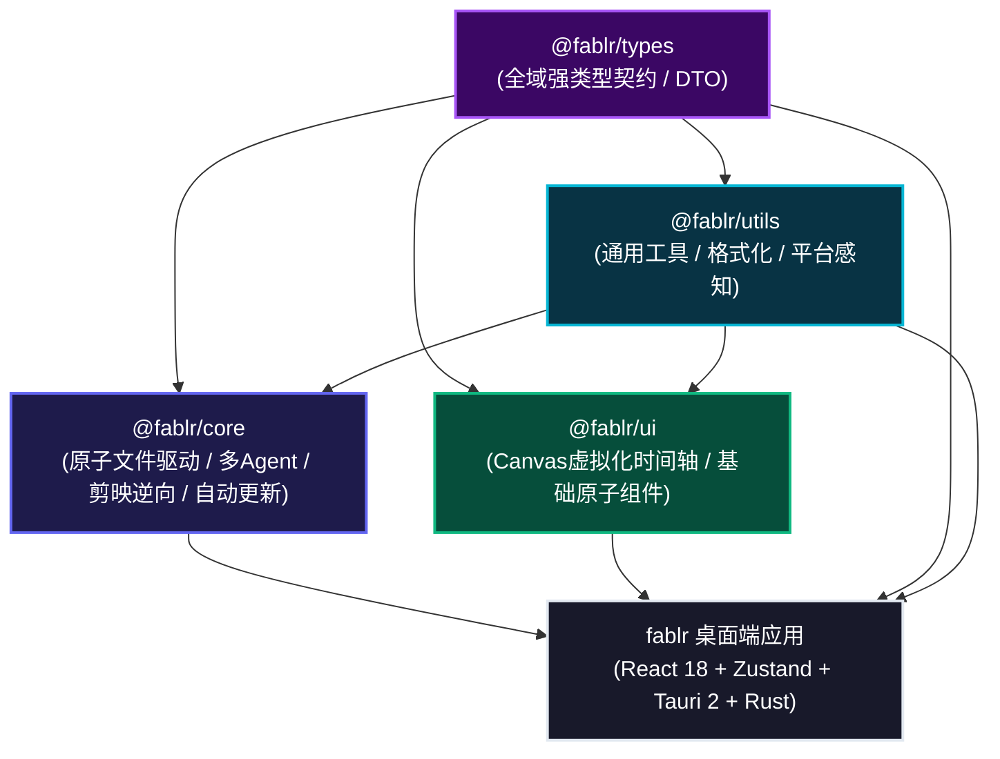
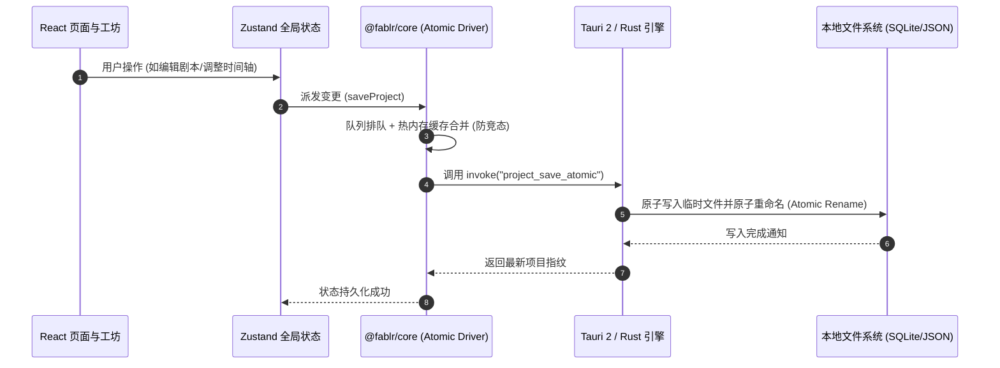

# 系统整体架构与分层设计

## 1. 架构总览与 Monorepo 分层

Fablr (剧工) 采用现代化的 **Monorepo (Turborepo + pnpm workspaces)** 架构体系，将通用契约、基础工具、领域服务与高性能渲染组件严格分层解耦：

---

## 2. 各 Package 职责边界与规范

| Package | 职责范围 | 典型模块 / 导出品 | 依赖约束 |
| :--- | :--- | :--- | :--- |
| **`@fablr/types`** | 系统全域类型契约、领域模型 DTO、IPC 接口规范 | `Project`, `ScriptBlock`, `AssetClip`, `AppUpdateInfo` | **零依赖**（禁止依赖任何其他包） |
| **`@fablr/utils`** | 纯函数工具、文件大小/时间格式化、平台感知、防抖节流 | `formatFileSize`, `formatDuration`, `detectHostPlatform` | 仅允许依赖 `@fablr/types` |
| **`@fablr/core`** | 领域核心服务、防竞态文件驱动、多 Agent 状态机、更新检测 | `AtomicProjectFileDriver`, `UpdaterService`, `DramaAgents` | 依赖 `types` 与 `utils` |
| **`@fablr/ui`** | 硬件加速时间轴 Canvas 组件、工业级交互图元 | `VirtualTimelineCanvas`, `WaveformRenderer` | 依赖 `types` 与 `utils` |
| **主应用 (`src/`)** | 路由、页面装配、Zustand 全局状态机、Tauri IPC 接入 | `AssetHubPage`, `ScriptStudioPage`, `WorkspacePage` | 聚合调用上方 Packages |

---

## 3. 全链路数据流转模型

---

## 4. 技术栈选型原则

1. **本地优先与绝对隐私**：所有媒体资产与草稿工程均存储于用户磁盘，零强制上传；
2. **轻量极致与秒级启动**：基于 Tauri 2 + Rust，杜绝传统 Chromium 庞大臃肿的内存占用；
3. **架构防腐与单向数据流**：强类型约束与严格的 Monorepo 分包，禁止跨层循环引用。
