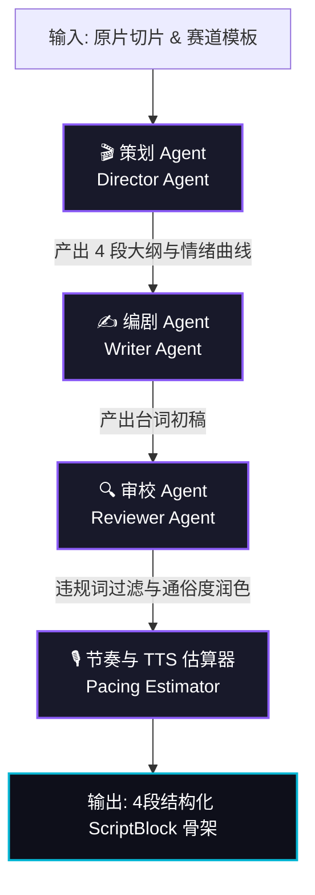
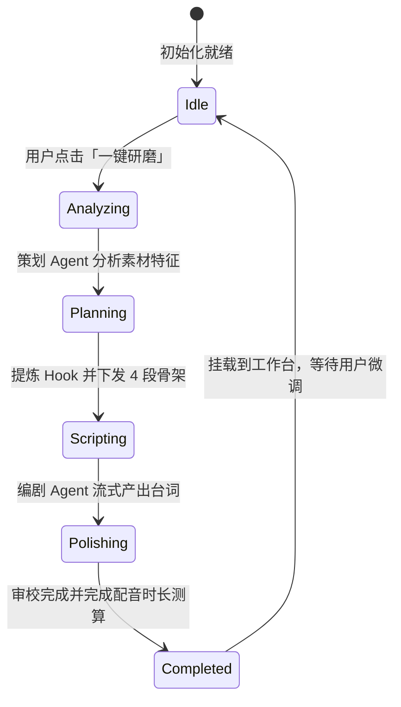

# 多 Agent 协同编排与状态机 (Multi-Agent System)

## 1. 架构角色划分与职责

Fablr 的剧本创作不是单一 Prompt 的堆砌，而是构建了一个具备**职责隔离**与**互检机制**的多 Agent 协作闭环：

| Agent 角色 | 核心职责 | 输入上下文 | 产出品 |
| :--- | :--- | :--- | :--- |
| **Director (策划)** | 分析原片高光切片，提炼黄金 3 秒 Hook 与整体情绪走向 | 素材标签、ASR 原文、选定题材 | 结构化分镜规划与 Hook 设定 |
| **Writer (编剧)** | 按照 4 段骨架撰写富有冲突感、画面感的解说词 | 策划大纲、角色人设、对峙关系 | 4 段解说台词原始草稿 |
| **Reviewer (审校)** | 违规词拦截、口语化润色、消除生僻拗口字词 | 台词草稿、平台敏感词表 | 润色后高可听性文稿 |
| **Pacing (节奏)** | 按汉语语速模型（4字/秒）推算每段时长并检测节奏失衡 | 润色文稿 | 精确配音秒数与时长标签 |

---

## 2. 流式协同状态机 (Streaming State Machine)

多 Agent 协同采用事件驱动与流式响应机制，创作者在前端可以实时看到 AI 推演与卡片生成的逐字渲染过程：

---

## 3. 黄金 3 秒 Hook 提炼算法

在 `drama-agents.ts` 中，Director Agent 采用三种高转化 Hook 策略库：
1. **最高潮画面前置 (Climax-First)**：提取置信度最高与爆点密度最大的场景作为首帧切入；
2. **反常识冲突提问 (Counter-Intuitive Question)**：通过巨大阶层、生死或伦理反差发问；
3. **数字倍数放大 (Data Magnification)**：量化事件极端程度，激发观众好奇心。
