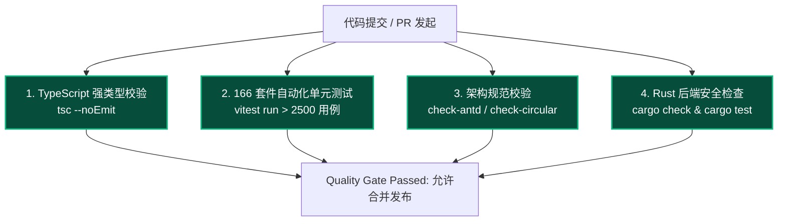

# 质量门禁与测试规范

## 1. 自动化质量门禁体系

Fablr 建立了极其严苛的工程化与自动化测试门禁体系，确保每次提交与 PR 均保持 100% 可构建与高质量：



---

## 2. 核心架构约束规则

### 2.1 UI 约束：严禁引入 Ant Design (0-antd 策略)
依据项目核心设计准则 ADR-002，Fablr 全面采用现代黑曜石工业风 UI 组件库，**严禁在代码中直接或间接 import antd 组件**。CI 门禁将通过 `scripts/check-antd.mjs` 进行全量源文件扫描。

### 2.2 架构约束：零循环依赖 (No Circular Dependencies)
通过 `scripts/check-circular-deps.mjs` 递归解析 ESM import 语法树并构建有向图，采用三色标记算法实时检测任何可能导致内存泄漏或打包顺序异常的循环依赖环。

### 2.3 视觉约束：统一 Design Tokens
所有颜色与字体必须遵循项目 Design Tokens 规范，禁止随意硬编码 6 位 hex 颜色或使用非规范 Tailwind 色板。

---

## 3. 单元测试与覆盖率指标

```bash
# 运行全部 166 个测试套件 (包含 2,500+ 个用例)
npm run test:run

# 查看覆盖率报告
npm run test:ci
```

- 核心业务逻辑（`@fablr/core` 中的 `AtomicProjectFileDriver`、`UpdaterService`、`drama-agents`）测试覆盖率达 **90%+**；
- 状态机（`updater-store`、`editor-store`）均具备完备的边界条件与异步并发测试用例。
