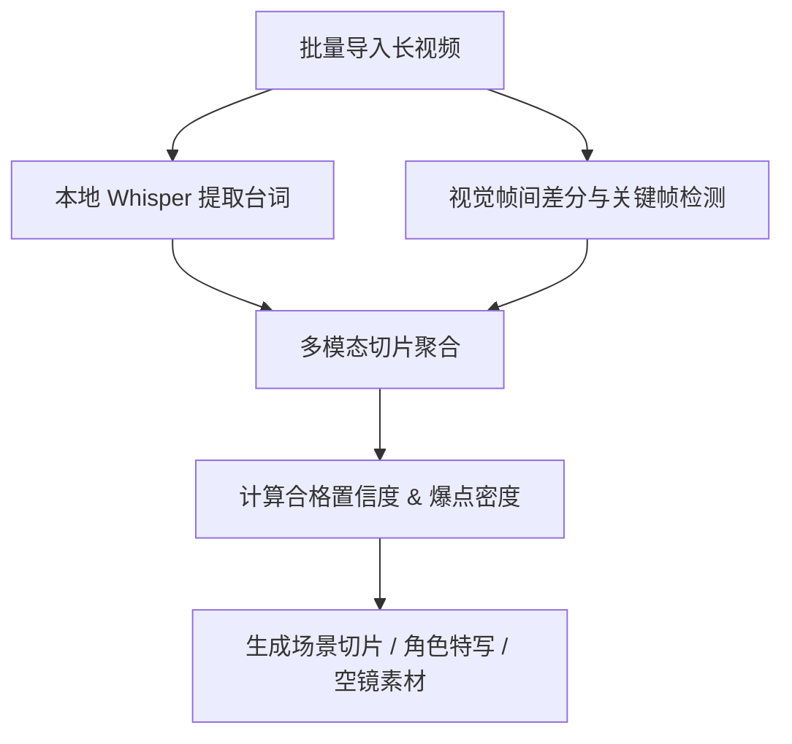
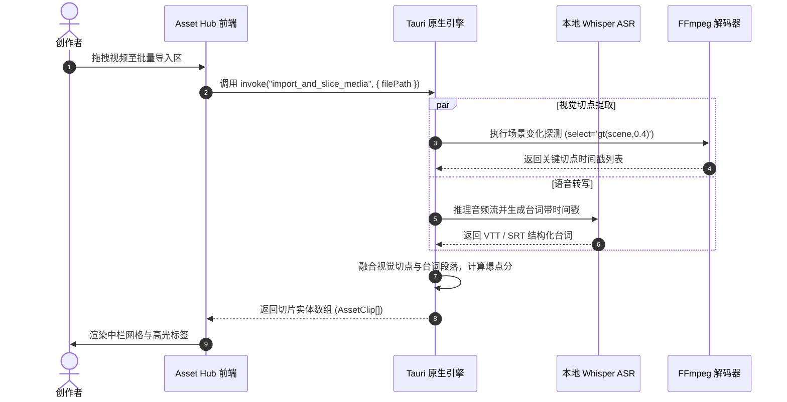

# 智能素材拆条工坊 (Asset Hub)

## 1. 业务背景与创作者痛点

影视二创与短剧解说的第一步是**素材整理**。传统流程中，博主需要耗费数小时拖拽播放器进度条，手动记录每个高潮镜头的入点 (In-Point) 与出点 (Out-Point)，极易造成遗漏且极其耗费精力。

**素材拆条工坊 (Asset Hub)** 通过本地轻量化 AI 算法，在导入素材的同时自动完成**镜头切点探测**、**ASR 离线转写**与**情绪爆点密度分析**，将长视频转化为可即时检索和调度的切片资产库。

---

## 2. 创作者实操 SOP



### 操作步骤
1. **左侧目录导航**：支持分类查看 `场景切片`、`角色特写`、`空镜素材` 与 `原片音轨 ASR`；
2. **快捷检索与标签过滤**：
   - 在搜索框输入台词关键词（如 `“开枪”`、`“离婚”`、`“真相”`）秒级定位对应切片；
   - 点击 `打斗 🥊`、`悬疑 🔍`、`反转 🔄`、`高潮 💥` 情绪滤镜快速筛选镜头；
3. **右侧属性监看**：
   - 监看切片视频画面；
   - 查看 AI 评估指标：`合格置信度 (Confidence %)` 与 `爆点密度 (Density pts)`；
   - 校验 ASR 原片台词转写内容；
4. **一键工坊联动**：点击「添加到剪辑时间轴」或「一键送入剧本工坊」。

---

## 3. 底层架构与数据契约

### 切片模型数据契约 (`AssetClip`)

```typescript
export interface AssetClip {
  id: string;                    // 切片唯一标识
  title: string;                 // 镜头语义标题
  duration: string;              // 时长 (如 "00:18")
  durationSec: number;           // 秒数
  resolution: string;            // 分辨率 (如 "1080P" / "4K")
  tags: string[];                // 标签 (如 ["高潮反转", "主角对峙"])
  transcript: string;            // ASR 转写台词内容
  confidence: number;            // 画面质量置信度 (0-100)
  density: number;               // 爆点指数密度 (0-100)
  inPointSec: number;            // 原片入点时间戳
  outPointSec: number;           // 原片出点时间戳
  sourceFilePath: string;        // 本地源文件绝对路径
}
```

### 镜头切点与 ASR 对齐时序图



---

## 4. 常见排错与调优技巧

- **Q：导入 4K 巨型文件时转写缓慢？**  
  *A：进入设置开启 GPU 硬件加速，或将 Whisper 模型切换为 `tiny` / `base` 极速模式。*
- **Q：切片时间戳与台词存在轻微偏差？**  
  *A：在右侧属性检查栏中可直接双击入出点秒数进行微调校准。*
