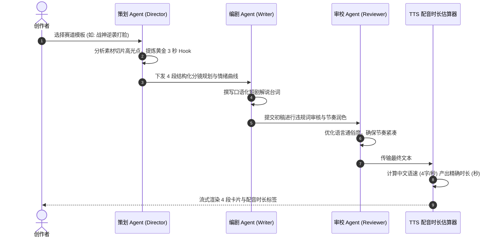

# 剧本研磨工坊 (Script Studio)

## 1. 业务背景与工业化剧本模型

在影视解说赛道，视频的完播率与前 3 秒的留存率（Hook 率）直接决定了平台算法推荐量。传统长篇大论的 AI 生成文案存在三大通病：**无节奏把控**、**缺乏冲突高潮**、**无法预估配音时长**。

剧工 (Fablr) 借鉴业界标杆（HeyGen/Descript）的卡片骨架理念，首创 **4 段式工业级剧本骨架模型**，并通过多 Agent 协同体系进行结构化推演。

---

## 2. 4 段结构化剧本卡片模型


1. **🪝 黄金3秒 Hook**：
   - 核心法则：最高潮画面前置 / 悬念冲突发问 / 巨大数字反差。
   - 示例：*「她以为死去的丈夫，此刻竟然就站在门口冲她冷笑...」*
2. **📖 主线递进**：
   - 承接 Hook，快速梳理背景、人物关系与核心利益矛盾。
3. **🔥 高潮反转**：
   - 情绪爆发点，节奏加速，揭露真相或高能打脸反转。
4. **🎯 互动结尾**：
   - 留存悬念，引导评论区互动：*「结局究竟如何？关注我，下期揭晓！」*

---

## 3. 多 Agent 研磨机制与时序



---

## 4. 核心数据契约 (`ScriptBlock`)

```typescript
export type ScriptBlockType = 'hook' | 'act' | 'climax' | 'ending';

export interface ScriptBlock {
  id: string;                    // 段落唯一标识 (如 "block_hook_1719800")
  type: ScriptBlockType;         // 4 段类型
  title: string;                 // 卡片标题
  content: string;               // 台词内容
  durationEstimate: number;      // 毫秒级/秒级配音时长预估
  linkedClipIds: string[];       // 关联的 Asset Hub 视频切片 ID
  collapsed: boolean;            // 折叠状态
  isAiGenerated: boolean;        // 是否由 AI 生成
}
```

---

## 5. 常见排错与技巧

- **Q：如何调整单段卡片的语速与时长？**  
  *A：在文本框内直接删减文字，卡片右上角的「配音约 XX 秒」标签会毫秒级联动重新计算。*
- **Q：想对某一段台词进行单独重新润色？**  
  *A：点击卡片右上角的「✨ AI 润色」或卡片底部的「🔄 AI 续写」即可局部迭代。*
