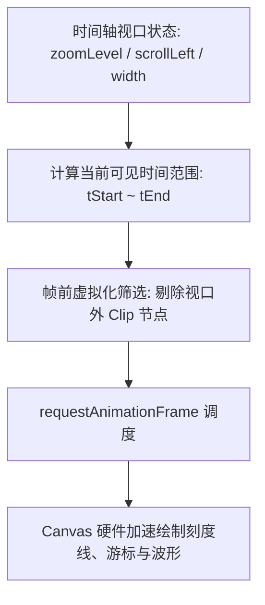

```mermaid
gantt
    title 5 轨视听时间轴对齐演示
    dateFormat  X
    axisFormat %s秒

    section V2 画中画光影
    暗角噪点滤镜       :v2_1, 0, 45
    环境光晕FX         :v2_2, 45, 90

    section V1 画面主轨
    黄金Hook特写       :v1_1, 0, 6
    主角争执对峙       :v1_2, 6, 42
    高潮打脸大反转     :v1_3, 42, 80
    片尾悬念定格       :v1_4, 80, 90

    section A1 解说配音
    Hook抓人配音       :a1_1, 0, 6
    主线剧情推进配音   :a1_2, 6, 42
    高潮爆发配音       :a1_3, 42, 80
    引导点赞配音       :a1_4, 80, 90

    section A2 情绪 BGM
    悬疑压抑氛围       :a2_1, 0, 42
    节奏爆发爽感       :a2_2, 42, 90

    section A3 动作音效
    重击_FX            :a3_1, 5, 6
    反转_FX            :a3_2, 42, 43
```

# 5 轨剪辑工作台 (Workspace)

## 1. 业务背景与双模式设计

视听语言的核心在于**音画对齐**。传统剪辑软件（如 Premiere、Final Cut）由于是基于时间的非线性编辑工具，处理图文/解说类视频需要创作者反复在文案和时间轴之间对照。

**5 轨剪辑工作台 (Workspace)** 提供两种互补视图：
- **以文剪片视图 (Script-Driven Mode)**：创作者只需专注剧本卡片，系统自动根据文意和时长将对应视频镜头、配音与音效对齐；
- **5 轨多轨时间轴 (5-Track Timeline Mode)**：面向工业级后期微调，基于 Canvas + RAF 硬件加速虚拟化渲染。

---

## 2. 5 轨视听架构规范

```
[V2 轨道] ── 画中画 / 动态光影 / 贴纸滤镜轨
[V1 轨道] ── 画面主视频轨 (场景切片 / 特写镜头)
[A1 轨道] ── 解说配音主轨 (TTS 语音合成 / 纯净人声)
[A2 轨道] ── 情绪 BGM 轨 (动态闪避 Ducking / 氛围音乐)
[A3 轨道] ── 动作音效 FX 轨 (重击 / 反转 / 拔枪 / 开门音效)
```



---

## 3. Canvas 虚拟化时间轴技术实现

在包含上百个视频切片与高密度音频波形时，传统 DOM/SVG 渲染方案会导致严重的掉帧与内存暴涨。Fablr 采用自主研发的 `VirtualTimelineCanvas`（位于 `@fablr/ui`）：



### 核心特性：
- **60 FPS 流畅交互**：拖拽游标、按住 `Cmd/Ctrl + 滚轮` 无极缩放毫秒级响应；
- **音频波形实时投影**：通过 Web Audio API 离线提取波形峰值，绘制高清音频振幅；
- **磁吸对齐系统 (Snapping)**：移动素材时自动吸附至临近素材边缘或游标切点。

---

## 4. 常见排错与操作技巧

- **快捷键盲操**：
  - `Space`：播放 / 暂停视听预览；
  - `J` / `K` / `L`：倒放 / 暂停 / 倍速快进；
  - `Cmd/Ctrl + Z`：撤销时间轴操作（全局 Undo/Redo 状态机托管）；
  - `S`：在游标所在位置切断当前选中的片段。
