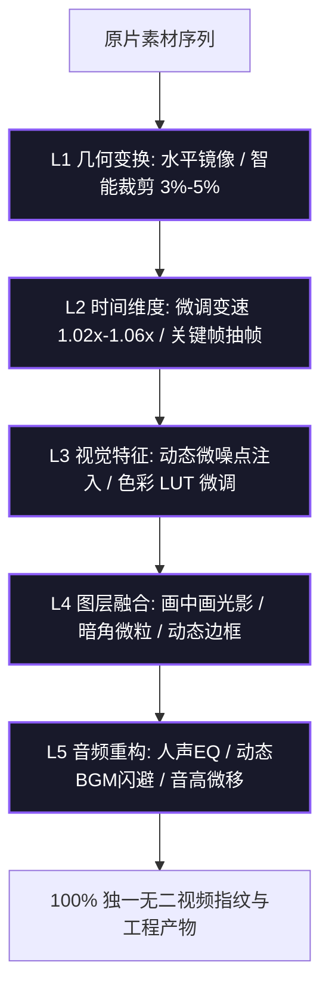
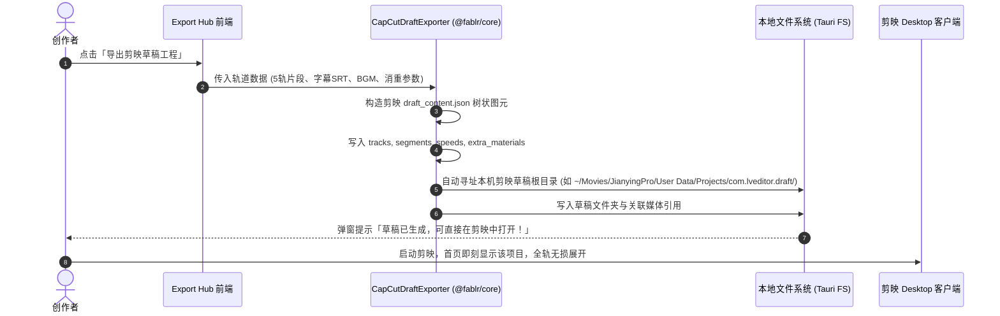

# 消重发布工坊 (Export Hub)

## 1. 业务背景与平台消重合规

短视频平台（如抖音、快手、TikTok、B站、视频号）部署了先进的**视频指纹比对算法**与**MD5/帧特征检测引擎**。直接裁剪原片极易被标记为「非原创内容」或遭到限流。

**消重发布工坊 (Export Hub)** 提供了两项核心能力：
1. **工业级 5 级消重合规矩阵**：多维度改变视觉特征值与音频频谱；
2. **剪映草稿工程 (CapCut Draft) 逆向导出**：直接生成原生剪映草稿，保留所有图层与关键帧，赋能创作者在剪映中 1 秒接续精剪。

---

## 2. 5 级消重矩阵参数详解

| 消重层级 | 处理手段 | 算法原理与防检测考量 |
| :--- | :--- | :--- |
| **Level 1: 几何变换** | 水平镜像 + 智能微裁 (3%~5%) | 破坏视觉特征点坐标阵列，避开中心对称检测 |
| **Level 2: 时间流速** | 微变速 (1.03x) + 动态抽帧 | 打乱音频与画面的 PTS/DTS 时间戳序列，彻底改变视频总帧数 |
| **Level 3: 视觉特征** | 动态微噪点 + 曲线微调 | 引入人眼几乎不可见的随机高斯噪点，彻底改变帧哈希值 (pHash) |
| **Level 4: 空间图层** | 画中画叠加 + 氛围光晕 | 增加第二层半透明融合图层，改变化片直方图分布 |
| **Level 5: 音频指纹** | 人声音高微调 (Pitch Shift) + 动态降噪 | 改变声音频谱特征，阻断音频声学指纹匹配 |

---

## 3. 剪映草稿逆向导出技术架构

传统视频工具仅支持导出合并后的 `.mp4` 文件，创作者若想修改字幕错别字或调整特效，必须从头再来。

Fablr 逆向解析了剪映 Desktop 版本的工程结构协议，生成符合剪映规范的 `draft_content.json` 与 `draft_meta_info.json`：

---

## 4. 常见排错与注意事项

- **Q：剪映草稿打开后提示素材离线？**  
  *A：Fablr 默认使用绝对路径映射。若移动了源素材文件夹，只需在剪映中点击一次「定位素材」或在 Fablr 中重新导出草稿。*
- **Q：消重是否会导致画质明显受损？**  
  *A：Fablr 经过算法参数调优，默认推荐配置下的动态微噪点与微裁切在手机端肉眼无法察觉，兼顾了画质高清与合规过审。*
